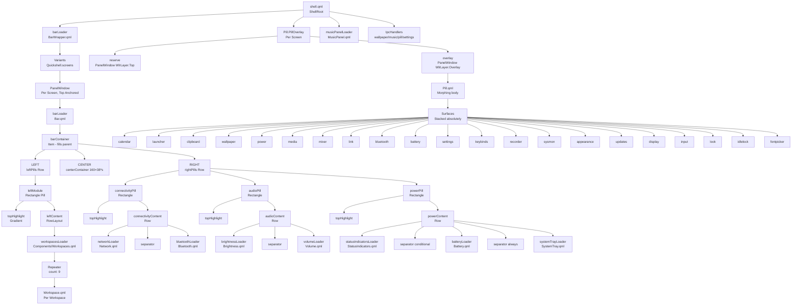
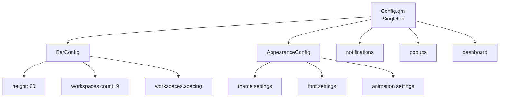
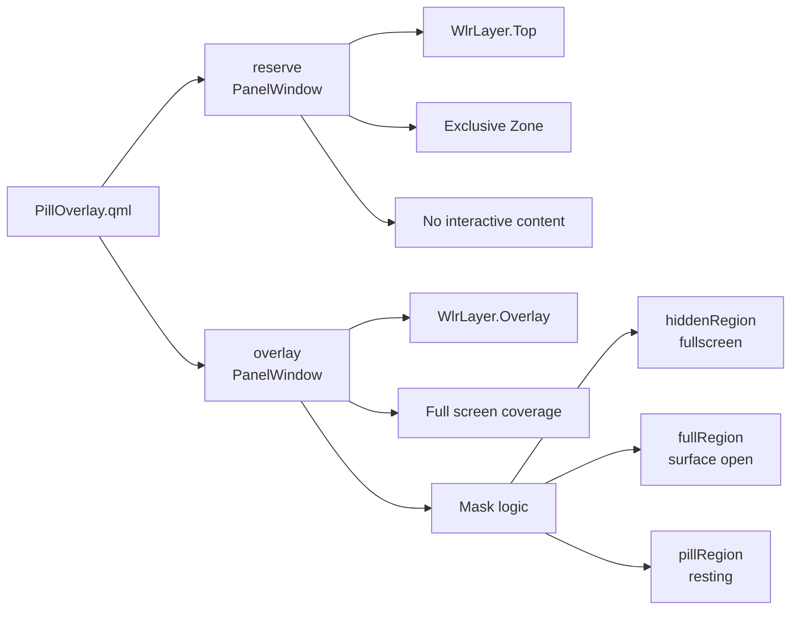

# QuickShell Project Map & Architecture

## Project Overview

QuickShell is a Qt 6.10 / QML desktop shell for Hyprland and Niri compositors. It provides a top bar, a morphing pill overlay system, notification handling, wallpaper management, and system integration through a service-oriented architecture.

**Key Technologies**: QtQuick 6.10, Quickshell framework, Wayland, PipeWire, NetworkManager, Bluetooth

---

## Directory Structure

```
.
├── shell.qml                    # Root entry point (ShellRoot)
├── config/                      # Configuration singletons
│   ├── Config.qml              # Master config aggregator
│   ├── BarConfig.qml           # Bar-specific settings
│   ├── AppearanceConfig.qml    # Theme/appearance settings
│   └── Appearance.qml          # Appearance logic
├── services/                    # Backend service singletons
│   ├── Notifs.qml              # Notification management
│   ├── Audio.qml               # PipeWire audio control
│   ├── Network.qml             # WiFi/NetworkManager
│   ├── Bluetooth.qml           # Bluetooth control
│   ├── Brightness.qml          # Display brightness
│   ├── VolumeMonitor.qml       # Volume monitoring
│   ├── Matugen.qml             # Dynamic color generation
│   ├── PowerProfiles.qml       # Power profile management
│   ├── SystemUsage.qml         # System resource monitoring
│   ├── Screenshot.qml          # Screenshot capture
│   ├── Logger.qml              # Logging service
│   └── IdleInhibitor.qml       # Idle/inhibit control
├── singletons/                  # Global state singletons
│   ├── Theme.qml               # Color palette & typography
│   ├── PillState.qml           # Pill surface open/close state
│   ├── Flags.qml               # Feature flags & preferences
│   ├── Metrics.qml             # Layout metrics & sizing
│   └── Dyn.qml                 # Dynamic wallpaper colors
├── modules/
│   ├── bar/                    # Top bar implementation
│   │   ├── BarWrapper.qml      # Per-screen PanelWindow wrapper
│   │   ├── Bar.qml             # Bar content & layout
│   │   └── components/         # Bar sub-components
│   │       ├── Workspaces.qml  # Workspace switcher
│   │       ├── Workspace.qml   # Single workspace dot
│   │       ├── Network.qml     # Network status icon
│   │       ├── Bluetooth.qml   # Bluetooth status icon
│   │       ├── Volume.qml      # Volume icon
│   │       ├── Brightness.qml  # Brightness icon
│   │       ├── Battery.qml     # Battery status
│   │       ├── StatusIndicators.qml  # Caffeine/DND indicators
│   │       └── *PopupWindow.qml # Popup panels for bar items
│   ├── pill/                   # Morphing pill overlay system
│   │   ├── PillOverlay.qml     # Per-screen overlay window
│   │   ├── Pill.qml            # Pill body & morphing logic
│   │   ├── PillSurface.qml     # Surface container
│   │   ├── Ame.qml             # Surface animation controller
│   │   ├── *                   # Individual surfaces (20+)
│   │   ├── lib/                # JavaScript utilities
│   │   └── Singletons/         # Pill-specific singletons
│   ├── music/                  # Music player panel
│   │   └── MusicPanel.qml
│   └── osd/                    # On-screen display
│       ├── Wrapper.qml
│       ├── VolumeOSD.qml
│       └── BrightnessOSD.qml
├── components/
│   └── effects/
│       └── Material3Anim.qml   # Material You animations
├── compositor/                 # Compositor abstraction
│   ├── Compositor.qml          # Hyprland/Niri dispatcher
│   ├── Hyprland.qml            # Hyprland backend
│   └── Niri.qml                # Niri backend
├── scripts/                    # Shell scripts for IPC & utilities
├── assets/gifs/                # GIF assets for wallpaper picker
├── state/                      # Runtime state files
└── YEMI SHELL DOC/             # Generated documentation
```

---

## Component Hierarchy



---

## Data Flow Diagram

```mermaid
graph LR
    A[Config<br/>QsConfig.Config] --> A1[bar.height: 60<br/>bar.padding: 4<br/>workspaces.count: 9]
    B[Theme<br/>QsSingletons.Theme] --> B1[cardBot → pillBg<br/>cream → pillBorder<br/>onGlow → active elements]
    C[Compositor<br/>QsCompositor.Compositor] --> C1[activeWsId<br/>getOccupiedWorkspaces()]
    D[Services] --> D1[IdleInhibitor.inhibited<br/>→ caffeine state]
    D --> D2[Notifs.dnd<br/>→ DND state]
    D --> D3[Battery<br/>Network<br/>Bluetooth<br/>Volume<br/>Brightness<br/>SystemTray]
    E[Popups] --> E1[bluetoothPopup<br/>Loaded in BarWrapper]
    E --> E2[networkPopup<br/>Loaded in BarWrapper]
    E --> E3[volumePopup<br/>Loaded in BarWrapper]
    E --> E4[brightnessPopup<br/>Loaded in BarWrapper]

    A --> F[Bar.qml]
    B --> F
    C --> F
    D --> F
    E --> F

    G[PillState<br/>QsSingletons.PillState] --> G1[openMon<br/>openSurface]
    G --> H[PillOverlay.qml]
    H --> I[Pill.qml]
    I --> J[Surfaces<br/>20+ surfaces]

    K[shell.qml<br/>IpcHandlers] --> G
    K --> L[Wallpaper<br/>Music<br/>Settings<br/>AltSwitcher]
```

---

## Service Map

| Service | File | Purpose | Key Properties |
|---------|------|---------|----------------|
| Notifs | `services/Notifs.qml` | Notification management & DND | `notifications`, `dnd`, `activeNotifications` |
| Audio | `services/Audio.qml` | PipeWire audio control | `sink`, `source`, `volume`, `muted` |
| Network | `services/Network.qml` | WiFi & network status | `networks`, `active`, `wifiEnabled` |
| Bluetooth | `services/Bluetooth.qml` | Bluetooth device management | `powered`, `connected`, `deviceName` |
| Brightness | `services/Brightness.qml` | Display brightness control | `brightness`, `monitors` |
| VolumeMonitor | `services/VolumeMonitor.qml` | Volume change detection | Events for volume changes |
| Matugen | `services/Matugen.qml` | Dynamic color generation | `colorsPath`, `reload()`, `applyWallpaper()` |
| PowerProfiles | `services/PowerProfiles.qml` | Power profile management | Profile switching |
| SystemUsage | `services/SystemUsage.qml` | CPU/RAM monitoring | System metrics |
| Screenshot | `services/Screenshot.qml` | Screenshot capture | Capture functions |
| Logger | `services/Logger.qml` | Logging infrastructure | Log levels |
| IdleInhibitor | `services/IdleInhibitor.qml` | Idle/inhibit control | `inhibited` |

---

## Singleton Map

| Singleton | File | Purpose | Key Properties |
|-----------|------|---------|----------------|
| Theme | `singletons/Theme.qml` | Color palette & typography | `onGlow`, `verm`, `cream`, `cardBot`, `font` |
| PillState | `singletons/PillState.qml` | Pill surface state | `openMon`, `openSurface`, `peekMon` |
| Flags | `singletons/Flags.qml` | Feature flags & preferences | `uiScale`, `uiFont`, `paletteMode` |
| Metrics | `singletons/Metrics.qml` | Layout metrics | `restHBase`, sizing constants |
| Dyn | `singletons/Dyn.qml` | Dynamic wallpaper colors | `primary`, `cream`, `surfaceContainerLow` |

---

## IPC Interface

The shell exposes IPC handlers for external control (e.g., from Hyprland keybinds):

| Handler | Target | Functions | Usage |
|---------|--------|-----------|-------|
| wallpaper | `wallpaper` | `random()`, `toggle(mon)` | `qs ipc call wallpaper random` |
| music | `music` | `toggle()` | `qs ipc call music toggle` |
| colors | `colors` | `reload()` | `qs ipc call colors reload` |
| altSwitcher | `altSwitcher` | `toggle()`, `open()`, `close()`, `next()`, `previous()` | Alt+Tab window switcher |
| settings | `settings` | `toggle()` | Open settings window |
| pill | `pill` | `launcher(mon)`, `mixer(mon)`, `calendar(mon)`, `clipboard(mon)`, `power(mon)`, `settings(mon)`, `keybinds(mon)`, `wallpaper(mon)`, `link(mon)`, `media(mon)`, `sysmon(mon)`, `peek(mon)`, `hide()` | `qs ipc call pill launcher eDP-1` |

---

## Bar Layout Specification

### Dimensions

| Element | Size | Notes |
|---------|------|-------|
| Bar Height | `60px` | Fixed from `config.bar.height` |
| Bar Margins | `1*s` top/bottom, `9*s` left/right | Scaled by screen height |
| Pill Height | `28 * s` | All pills uniform height |
| Pill Radius | `14 * s` | Half of pill height |
| Pill Padding | `implicitWidth + 16 * s` | Horizontal padding |
| Center Spacer | `160 * s × 38 * s` | Prevents layout shift from PillOverlay |

### Spacing

| Element | Spacing |
|---------|---------|
| Left Pills | `8 * s` |
| Right Pills | `6 * s` |
| Workspace Dots | `6 * s` (from config) |
| Connectivity Pill | `4 * s` internal |
| Separators | `1 * s × 12 * s` |

### Animation

| Property | Duration | Easing |
|----------|----------|--------|
| Pill Width | 250-350ms | OutCubic / BezierCurve |
| Panel Open | 350ms | OutCubic |

---

## Pill Surface Map

The Pill.qml component supports 20+ morphing surfaces. Each surface has:
- Target width/height (scaled by `s`)
- An associated `ame` (Ame animation controller) item
- Entry in the `surfaces` property map

| Surface | Width | Height | Description |
|---------|-------|--------|-------------|
| rest | 160*s | restH | Default pill state |
| hover | hoverW | 58*s | Hover/pinned state |
| calendar | calendarW | calendarH | Calendar widget |
| launcher | 360*s | 332*s | App launcher |
| clipboard | 360*s | 332*s | Clipboard history |
| wallpaper | 720*s | 172*s | Wallpaper picker |
| power | 330*s | 150*s | Power menu |
| media | 390*s | 150*s | Media controls |
| mixer | 93*max(4,faderCount)*s | 214*s | Audio mixer |
| link | link.desiredW | linkH+26*s | Network/connectivity |
| bluetooth | linkBt.desiredW | linkBtH+26*s | Bluetooth devices |
| battery | 316*s | batteryH+26*s | Battery details |
| settings | 392*s | settingsH+29*s | Settings panel |
| keybinds | 460*s | keybindsH+29*s | Keybindings list |
| recorder | 384*s | recorderH+33*s | Screen recorder |
| sysmon | 392*s | sysmonH+33*s | System monitor |
| appearance | 392*s | appearanceH+29*s | Appearance settings |
| updates | 360*s | updatesH+29*s | System updates |
| display | 392*s | displayH+29*s | Display settings |
| input | 392*s | inputH+29*s | Input settings |
| look | 392*s | lookH+29*s | Look & feel |
| idlelock | 392*s | idlelockH+29*s | Idle lock settings |
| fontpicker | 360*s | fontpickerH+29*s | Font picker |
| osd | - | - | On-screen display |
| toast | 342*s | - | Notification toast |
| quickChoose | 344*s | 76*s | Quick record chooser |
| quickCount | 150*s | 64*s | Quick record countdown |

---

## Compositor Integration

### Compositor.qml

Abstracts Hyprland and Niri backends:

```mermaid
graph LR
    A[Compositor.qml] --> B[detectCompositor()]
    B --> C[Hyprland]
    B --> D[Niri]
    A --> E[impl]
    E --> F[toplevels]
    E --> G[workspaces]
    E --> H[monitors]
    E --> I[activeToplevel]
    E --> J[focusedWorkspace]
    E --> K[focusedMonitor]
    E --> L[activeWsId]
    A --> M[rawEvent signal]
```

**Detection Logic**:
- Checks `XDG_CURRENT_DESKTOP` and `DESKTOP_SESSION` environment variables
- Defaults to Hyprland if neither detected

---

## Configuration Architecture



---

## Key Relationships

### Bar → Services

| Bar Component | Service Dependency |
|---------------|-------------------|
| Workspaces | Compositor (workspaces, activeWsId) |
| Network | Network.qml (networks, active, wifiEnabled) |
| Bluetooth | Bluetooth.qml (powered, connected) |
| Volume | Audio.qml (volume, muted) |
| Brightness | Brightness.qml (brightness) |
| Battery | SystemUsage.qml (battery) |
| StatusIndicators | IdleInhibitor.qml, Notifs.qml (dnd) |

### Pill → Services

| Surface | Service Dependency |
|---------|-------------------|
| launcher | Apps (via desktop entries) |
| mixer | Audio.qml (sink, source) |
| calendar | System date/time |
| clipboard | Cliphist (clipboard history) |
| wallpaper | Matugen.qml, Dyn.qml |
| power | PowerProfiles.qml |
| media | Players.qml (MPRIS) |
| link | Network.qml, Bluetooth.qml |
| bluetooth | Bluetooth.qml |
| battery | SystemUsage.qml |
| settings | Config.qml |
| sysmon | SystemUsage.qml |
| recorder | ScreenRec.qml |

---

## Window Architecture

### Two-Window Pill System

The PillOverlay uses a two-window architecture for proper layer-shell integration:



**Reserve Window**: Claims top strip as exclusive zone so tiled windows sit below the pill's resting position.

**Overlay Window**: Full-screen window containing the Pill, fullscreen detection, and mask logic.

---

## State Management

### PillState (Global)

Single source of truth for which pill surface is open:

```
openMon: string      # Monitor name where pill is open
openSurface: string  # Surface name (e.g., "launcher", "mixer")
peekMon: string      # Monitor for peek preview
```

### ShellRoot State

```
barWindow: var           # Reference to BarWrapper window
musicVisible: bool       # Music panel visibility
savedGifIndex: int       # Current GIF index for wallpaper picker
currentWallpaper: string # Current wallpaper path
wallpaperList: var       # Available wallpapers
wallpaperHashes: var     # Wallpaper hash cache
```

---

## Build & Runtime

### Entry Point

`shell.qml` → `ShellRoot` (Quickshell root object)

### Initialization Order

1. `ShellRoot` created
2. Services instantiated (Notifs, Matugen, Audio, Brightness)
3. `barLoader` loads `BarWrapper.qml`
4. `BarWrapper` creates per-screen `PanelWindow` instances
5. Each `PanelWindow` loads `Bar.qml`
6. `PillOverlay` instances created per screen via `Variants`
7. `PillOverlay` creates reserve + overlay windows
8. `Pill.qml` instantiated in overlay
9. `initStateDir` process runs to create state directories
10. `currentWallProc` loads current wallpaper
11. `loadSavedGifIndexProc` restores GIF picker state

### IPC Commands

External control via `qs ipc call`:

```bash
qs ipc call wallpaper random
qs ipc call music toggle
qs ipc call colors reload
qs ipc call pill launcher eDP-1
qs ipc call settings toggle
```

---

## File Count Summary

| Category | Count |
|----------|-------|
| QML Files | ~80+ |
| Services | 12 |
| Singletons | 5 |
| Bar Components | 10 |
| Pill Surfaces | 20+ |
| Bar Popups | 5 |
| Scripts | 6 |
| Documentation | 50+ |

---

## Existing Diagram Reference

The project includes `quickshell-bar-diagram.html` which documents:
- Visual bar layout with SVG
- Component hierarchy (Mermaid)
- Bar dimensions & spacing
- Pill anatomy
- Data flow diagram
- Component specifications for each bar pill

This document (`PROJECT_MAP.md`) expands on that to cover the **entire project** including services, singletons, pill system, compositor integration, IPC interface, and configuration architecture.
