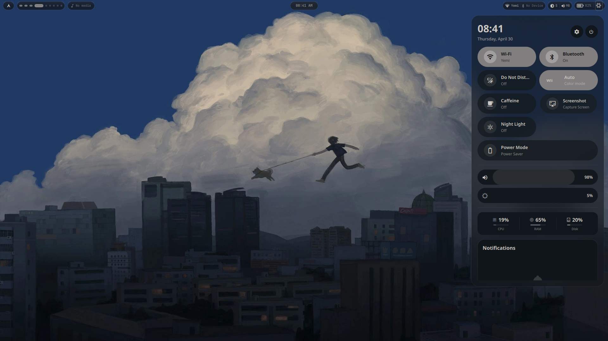
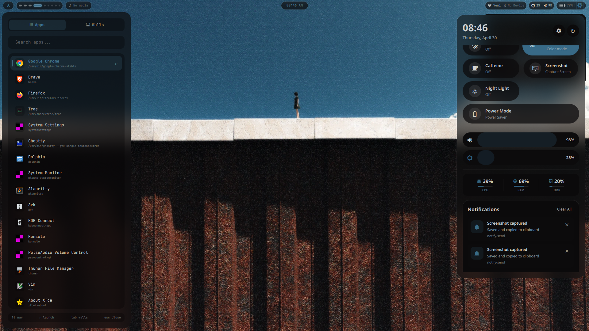
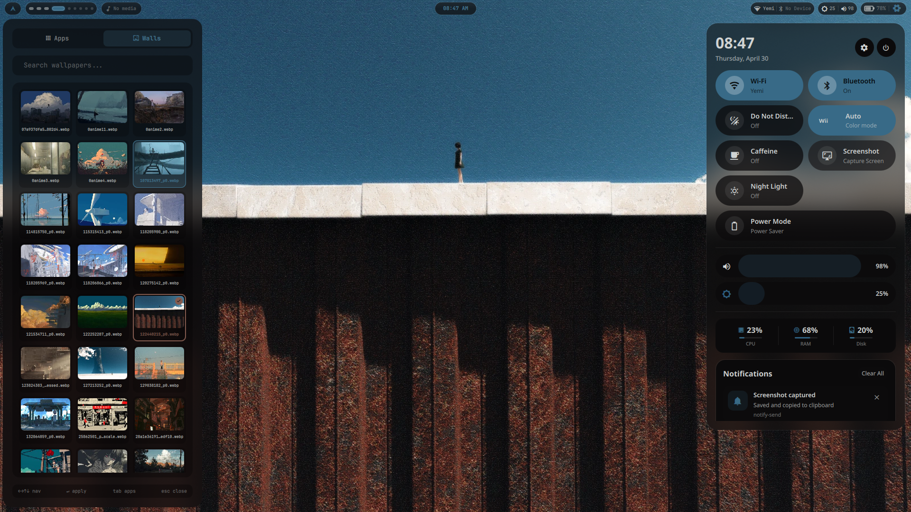

# QuickShell + Hyprland Rice

A sleek, modern desktop experience combining QuickShell's QML-based interface with Hyprland compositor. Features dynamic theming via Pywal and a highly integrated workflow.

## Screenshots





## Features

- **QuickShell Interface**: Modern QML-based shell with launcher, music controls, and wallpaper picker
- **Dynamic Theming**: Real-time color generation from wallpapers via Pywal
- **Integrated Components**: Full system integration including notifications, audio control, brightness, and more
- **Smart App Launcher**: Usage-based sorting and desktop file integration with app usage tracking
- **Wallpaper Management**: Built-in wallpaper browsing, thumbnail generation, and random wallpaper selection
- **Music Integration**: Direct music controls with album art display and playback management
- **Touchpad Gestures**: Support for advanced gesture controls via libinput-gestures
- **Notification Center**: Full-featured notification management with swaync
- **Fast Performance**: Optimized for responsiveness and low resource usage
- **Pywal Integration**: Automatic color scheme generation that applies across all compatible components
- **Color Mode Toggling**: Ability to switch between auto/light/dark modes based on wallpaper
- **Application Usage Tracking**: Remembers frequently used applications and sorts them accordingly
- **Video Wallpaper Support**: Support for animated video wallpapers with smooth transitions

## Dependencies

### Core Components
- Hyprland (compositor)
- QuickShell (shell interface)
- awww (wallpaper engine - swww fork with additional features)
- python-pywal (color generation)

### Audio Stack
- Pipewire
- Wireplumber
- Pipewire-Pulse
- Pipewire-ALSA
- ALSA utilities
- MPD (Music Player Daemon)
- MPC
- Pavucontrol-Qt
- Amixer
- RMPD (AUR)
- MPD-MPRIS (AUR)

### Utilities
- Kitty terminal
- Thunar file manager
- SwayNotificationCenter (notifications)
- Brightnessctl
- Wl-clipboard + Cliphist
- Grim + Slurp (screenshots)
- JQ (JSON processing)
- Xdotool (X11 compatibility)
- Fastfetch
- Kdeconnect
- DBus

### Image Processing
- ImageMagick
- VIPStools (as fallback for thumbnail generation)

### Fonts
- JetBrains Mono Nerd Font
- FiraCode Nerd Font
- Noto Fonts (regular + CJK)
- Twemoji Color Font

### Shell
- ZSH
- CachyOS ZSH Config
- PowerLevel10K (AUR)

## Installation

1. Clone this repository to `~/.config/quickshell/`
2. Run the installation script:
   ```bash
   cd ~/.config/quickshell/
   chmod +x install.sh
   ./install.sh
   ```
3. Copy your wallpapers to `~/wallpapers/`
4. Reboot or log into Hyprland session

## Pywal Theming

Pywal dynamically extracts colors from your current wallpaper to theme various applications. When a new wallpaper is selected, the `after-wall.sh` script triggers Pywal to generate a new color scheme which is then applied to the shell, terminal themes, and other compatible applications. The color scheme is stored in `~/.cache/wal/colors.json` and persists across sessions.

The process works in this sequence:
1. User selects a wallpaper via QuickShell's wallpaper picker
2. `after-wall.sh` executes `wal -i <wallpaper>` to generate color scheme
3. Generated colors are stored in `~/.cache/wal/colors.json`
4. QuickShell receives an IPC signal to reload the color scheme
5. All UI elements update to match the new colors
6. Terminal themes (Kitty, Alacritty) are automatically updated

Additionally, the color mode can be toggled between automatic detection, light, and dark themes using the toggle-colormode script, which maintains state in `~/.config/quickshell/state/colormode`.

## Key Bindings

The rice includes a comprehensive set of keyboard shortcuts:

| Keybind | Action |
|---------|--------|
| `SUPER + Return` | Open Kitty terminal |
| `SUPER + SHIFT + Return` | Open floating Kitty terminal |
| `SUPER + A` | Toggle launcher (QuickShell) |
| `SUPER + E` | Open Thunar file manager |
| `SUPER + SHIFT + Q` | Kill active window |
| `SUPER + SHIFT + Space` | Toggle floating |
| `SUPER + W` | Toggle wallpaper panel |
| `SUPER + SHIFT + W` | Random wallpaper |
| `SUPER + X` | Lock screen (hyprlock) |
| `SUPER + M` | Toggle music panel |
| `SUPER + F` | Toggle fullscreen |
| `SUPER + Arrow` | Move focus |
| `SUPER + SHIFT + Arrow` | Move window |
| `SUPER + CTRL + Arrow` | Resize window |
| `SUPER + Tab` | Cycle windows |
| `SUPER + 1-9` | Switch workspace |
| `SUPER + SHIFT + 1-9` | Move window to workspace |
| `SUPER + S` | Toggle special workspace |
| `SUPER + SHIFT + S` | Move to special workspace |
| `SUPER + P` | Toggle pseudo tiling |
| `SUPER + J` | Toggle split direction |
| `SUPER + N` | Toggle notification center |
| `SUPER + SHIFT + N` | Clear notifications |
| `Print` | Full screenshot |
| `SHIFT + Print` | Region screenshot |
| `SUPER + R` | Start screen recording |
| `SUPER + SHIFT + R` | Stop screen recording |
| `F1/F2/F3` | Volume mute/down/up |
| `F6/F7` | Brightness down/up |
| `SUPER + mouse drag` | Move/resize window |

## Credits

- Based on Harman1307's dotfiles: [Hyprland dotfiles](https://github.com/Harman1307/dotfiles-Hyprland)
- QuickShell configuration inspired by tripathiji1312's work: [QuickShell config](https://github.com/tripathiji1312/quickshell)