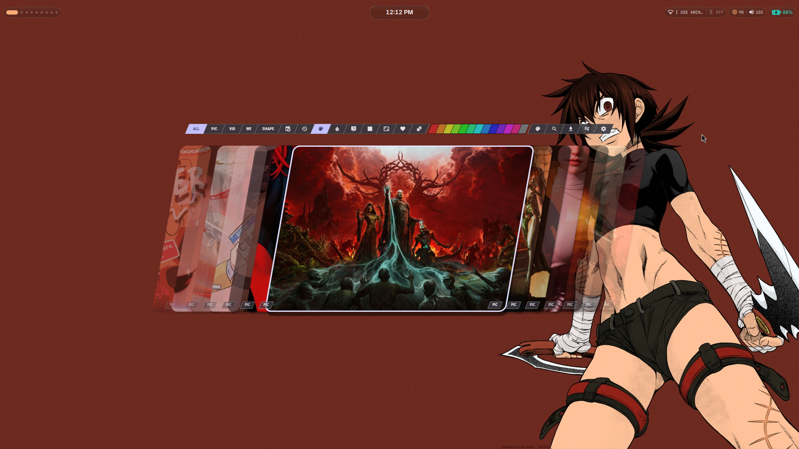
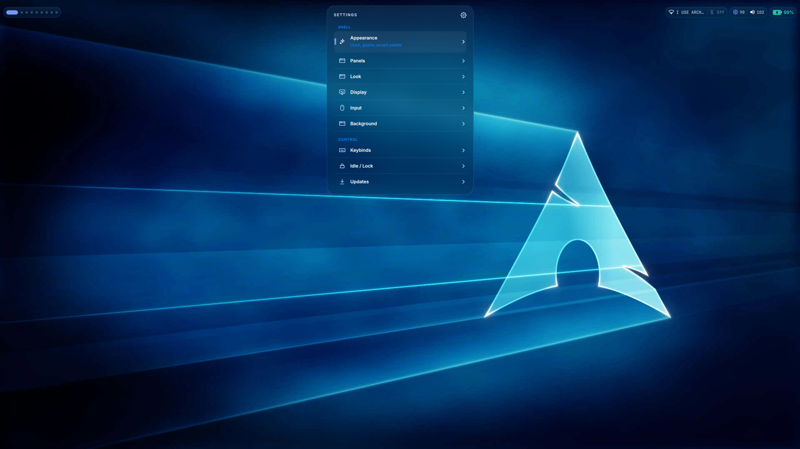
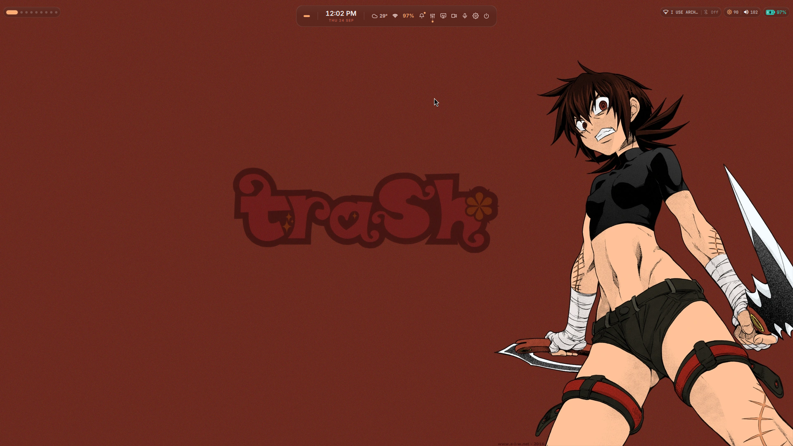
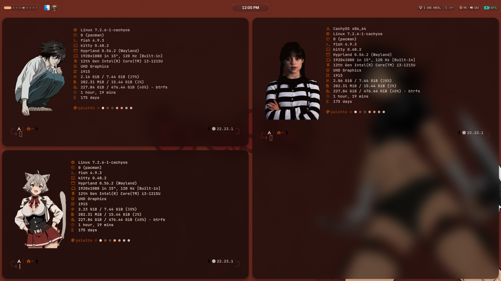

# YEMI-Shell

<div align="center">
  
  
  
  
  
</div>

<p align="center">
  <strong>A complete desktop shell for Hyprland and Niri, built on Quickshell.</strong>
</p>

<p align="center">
  <a href="#quick-start">Quick Start</a> •
  <a href="#screenshots">Screenshots</a> •
  <a href="#features">Features</a> •
  <a href="#installation">Installation</a> •
  <a href="#requirements">Requirements</a> •
  <a href="#configuration">Configuration</a> •
  <a href="#architecture">Architecture</a>
</p>

<p align="center">
  <video width="100%" controls autoplay loop muted playsinline>
    <source src="https://github.com/YemiPeter/YEMI-SHELL/raw/refs/heads/main/screenshots/2026-09-16%2014-38-59.mp4" type="video/mp4">
    <a href="https://github.com/YemiPeter/YEMI-SHELL/blob/main/screenshots/2026-09-16%2014-38-59.mp4">Watch the YEMI-Shell demo</a>
  </video>
</p>

---

## Overview

YEMI-Shell is a layered desktop shell experience built around Quickshell, tuned for smooth interaction, rich system integration, and a polished Material-inspired visual language.

It blends a morphing pill UI, dynamic wallpaper theming, compositor-aware behavior, and a modular QML architecture that is easy to extend.

- Per-monitor pill surfaces for launchers, media controls, weather, calendar, settings, and quick actions
- Wallpaper pipeline powered by `skwd` with live dynamic color generation
- Hyprland and Niri support with a shared backend abstraction
- Modular services for audio, network, brightness, power, updates, and media controls

---

---

## Quick Start

> This configuration expects to live at `~/.config/quickshell` (or under the directory named by `RICE_HOME`).

From the configuration directory, the direct launch is:

```bash
quickshell -p "$HOME/.config/quickshell/shell.qml"
```

For a session-safe startup, run the guarded launcher with Bash rather than relying on the shell's default syntax:

```bash
bash "$HOME/.config/quickshell/scripts/start-shell.sh"
```

This waits for the Wayland socket and the `skwd-walld` wallpaper backend before launching Quickshell, and exits cleanly if an instance is already running. To reload while developing, run:

```bash
bash "$HOME/.config/quickshell/reload-shell.sh"
```

### Verify the stack is live

```bash
systemctl --user status skwd-walld.service
skwd-helm current
pgrep -af "quickshell -p .*shell.qml"
```

If the wallpaper backend is active, `skwd-helm current` should print the current wallpaper path and the quickshell process should be running.

---

---

## Screenshots

<div align="center">
  <table>
    <tr>
      <td align="center"></td>
      <td align="center"></td>
    </tr>
    <tr>
      <td align="center"></td>
      <td align="center"></td>
    </tr>
    <tr>
      <td align="center"></td>
      <td align="center"></td>
    </tr>
    <tr>
      <td align="center"></td>
      <td align="center"></td>
    </tr>
  </table>
</div>

---

## Features

- A per-monitor morphing pill with launcher, calendar and weather, clipboard history, media controls, PipeWire mixer, Wi-Fi and Bluetooth controls, battery details, system monitor, recorder, wallpaper picker, power menu, and settings surfaces.
- A side bar with workspaces, active-app icons, network, Bluetooth, volume, brightness, battery, tray, and pop-up controls.
- A compositor abstraction for Hyprland and Niri. Hyprland uses Quickshell's native integration; Niri state is refreshed through its JSON IPC interface.
- A wallpaper pipeline powered by `skwd-wall`: static images, GIFs, and video files can be selected from the shell.
- Dynamic Material-style color schemes generated from the current wallpaper, with a warm fallback palette when no generated scheme is available.
- Media integration through MPRIS, PipeWire-aware audio controls, Cava visualizers, screenshot/recording helpers, idle controls, update checks, and an Alt+Tab overview.

## Requirements

The shell is designed for a Wayland session running either Hyprland or Niri. Install Quickshell with the services used by this configuration enabled, then add the tools for the features you want.

| Area | Required tools or services |
|:--|:--|
| Shell | `quickshell`, `qs`, and a compositor such as `hyprland` or `niri` |
| Wallpaper backend | `skwd-walld`, `skwd-helm`, and `skwd-wall` |
| Audio | PipeWire and WirePlumber (`wpctl`) |
| Network and Bluetooth | NetworkManager (`nmcli`) and BlueZ (`bluetoothctl`) |
| Power and brightness | UPower and `brightnessctl` |
| Theme and media pipeline | `jq`, Python 3, ImageMagick (`magick`), and the wallpapers directory in `~/Pictures/Wallpapers` |
| Screenshots and recording | `grim`, `slurp`, `wl-clipboard`, and `wf-recorder` |
| Optional extras | `cliphist`, `cava`, `hyprsunset`, `notify-send`, and a Nerd Font / Material Symbols font |

`scripts/set-wallpaper.sh` looks for wallpapers in `~/Pictures/Wallpapers` by default. The current selection is stored in `~/.local/state/quickshell-wallpaper`; generated palettes are written to `~/.cache/yemi-shell/`.

## Installation

The project now includes a simple front-door installer flow that mirrors the style of a polished shell project:

```bash
git clone https://github.com/YemiPeter/YEMI-SHELL.git
cd YEMI-SHELL
./setup install
```

The installer handles dependencies, system configuration, and theming setup. After installation, start the shell with:

```bash
./setup run
```

You can also inspect the exact actions before running them:

```bash
./setup install --dry-run
```

For a minimal setup without enabling system services:

```bash
./setup install --no-services
```

### Direct script access

```bash
./install.sh --dry-run
./install.sh
./install.sh --no-services
```

The installer does not edit compositor startup files; add `~/.config/quickshell/scripts/start-shell.sh` to either Hyprland or Niri after installation.

---

## Requirements

The shell is designed for a Wayland session running either Hyprland or Niri. Install Quickshell with the services used by this configuration enabled, then add the tools for the features you want.

```bash
git clone https://github.com/YemiPeter/YEMI-SHELL.git
cd YEMI-SHELL

# Inspect every package, file, and service action first.
./install.sh --dry-run

# Install dependencies and enable services.
./install.sh
```

Use `./install.sh --no-services` to install and copy the configuration without enabling system or user services. The installer does not edit compositor startup files; add `~/.config/quickshell/scripts/start-shell.sh` to either Hyprland or Niri after installation.

## Configuration

Persistent preferences live in `~/.local/state/quickshell/flags.json` and are managed by [`singletons/Flags.qml`](quickshell/singletons/Flags.qml). The file is created with defaults on first run and watched for changes, so it is safe to edit while the shell is running.

Useful settings include:

| Setting | Default | What it controls |
|:--|:--|:--|
| `paletteMode` | `"dynamic"` | Wallpaper-derived or static palette mode |
| `systemMood` | `"dark"` | Active generated scheme: `"dark"` or `"light"` |
| `uiScale` | `1.0` | Interface scaling |
| `reduceMotion` | `false` | Reduced animations |
| `time12h` / `clockSeconds` | `false` / `false` | Clock display |
| `pillOpacity` | `0.55` | Resting pill opacity |
| `weatherCity` | `""` | Optional weather-location override |
| `wallpapersDirectory` | `""` | Optional wallpaper-directory override |
| `altSwitcherLayout` | `"grid"` | Alt+Tab layout: `grid`, `list`, or `compact` |

Set `QS_DEBUG=1` before launching Quickshell to enable debug logging from the configuration.

## Wallpaper and Colors

`scripts/set-wallpaper.sh` is the single wallpaper setter. It records the selected path, applies it through `skwd-helm`, and invokes `scripts/after-wall.sh`.

`after-wall.sh` runs `scripts/dominance-engine.py` and writes a versioned dark-and-light color contract to `~/.cache/yemi-shell/colors.json`. [`singletons/Dyn.qml`](quickshell/singletons/Dyn.qml) watches that file and exposes the active scheme to the UI. The same pipeline also produces terminal colors and Hyprland border colors.

The legacy `wallcolors.py` pipeline remains available only when `YEMI_LEGACY_COLORS=1` is set.

## IPC

The root [`shell.qml`](quickshell/shell.qml) registers Quickshell IPC targets for the pill, wallpaper, media, audio, brightness, MPRIS, colors, settings, and Alt+Tab switcher. Examples:

```bash
# Toggle a pill surface on the focused monitor
qs ipc call pill launcher
qs ipc call pill clipboard

# Drive common controls
qs ipc call audio volumeUp
qs ipc call brightness increment
qs ipc call mpris playPause

# Choose another wallpaper or reload its palette
qs ipc call wallpaper random
qs ipc call colors reload
```

Run `qs ipc call pill <surface> <monitor>` when a compositor keybind should target a specific output.

## Architecture

```text
shell.qml
├── modules/bar/BarWrapper.qml       side bar and status controls
├── modules/pill/PillOverlay.qml     one overlay per screen
│   └── modules/pill/Pill.qml        morphing pill and surfaces
├── modules/background/Backdrop.qml  per-screen background layer
├── modules/music/MusicPanel.qml     detached music panel
├── modules/altswitcher/             Alt+Tab overview
├── services/                        audio, network, power, recording, updates …
├── singletons/                      preferences, palette, metrics, pill state
└── compositor/                      Hyprland and Niri backends
```

`compositor/Compositor.qml` chooses a backend from `XDG_CURRENT_DESKTOP` or `DESKTOP_SESSION`. The Niri backend polls `niri msg --json` every 500 ms for outputs, workspaces, and windows; Hyprland uses its native Quickshell integration.

## Project Layout

| Path | Purpose |
|:--|:--|
| `shell.qml` | Entry point and IPC handlers |
| `modules/` | Pill, bar, background, music, OSD, and window-switcher UI |
| `services/` | Integrations with system services and command-line tools |
| `singletons/` | Shared session state, theme, dynamic colors, and metrics |
| `compositor/` | Normalized Hyprland and Niri API |
| `scripts/` | Startup, wallpaper, color, terminal-theme, and maintenance scripts |
| `config.d/` | Niri startup configuration |

## License

This project is licensed under the GNU General Public License v3.0 (GPL-3.0). See [`LICENSE`](LICENSE).
