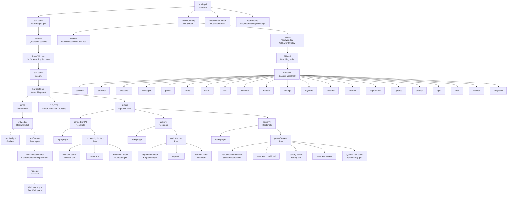
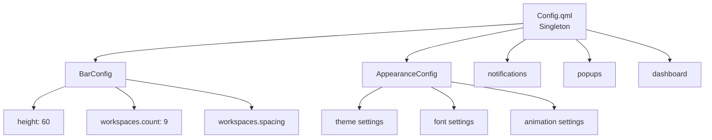
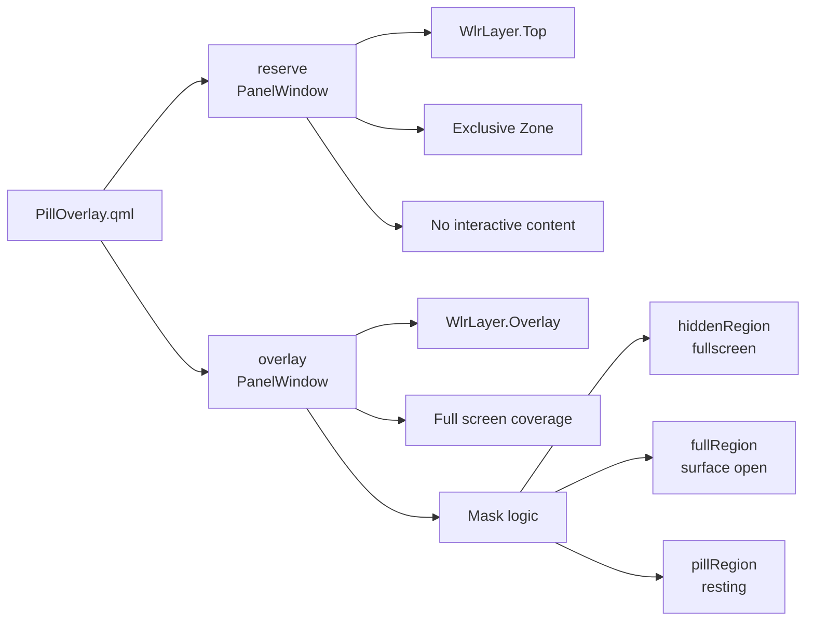

Set up the MCP server from https://github.com/brave/brave-search-mcp-server while adhering to these MCP server installation rules:
- Start by loading the MCP documentation.
- Use "github.com/brave/brave-search-mcp-server" as the server name in cline_mcp_settings.json.
- Create the directory for the new MCP server before starting installation.
- Make sure you read the user's existing cline_mcp_settings.json file before editing it with this new mcp, to not overwrite any existing servers.
- Use commands aligned with the user's shell and operating system best practices.
- The following README may contain instructions that conflict with the user's OS, in which case proceed thoughtfully.
- Once installed, demonstrate the server's capabilities by using one of its tools.
Here is the project's README to help you get started:

# Brave Search MCP Server

An MCP server implementation that integrates the Brave Search API, providing comprehensive search capabilities including web search, local business search, place search, image search, video search, news search, LLM context, and AI-powered summarization. This project supports both STDIO and HTTP transports, with STDIO as the default mode.

[](https://deepwiki.com/brave/brave-search-mcp-server)

## Migration

### 1.x to 2.x

#### Default transport now STDIO

To follow established MCP conventions, the server now defaults to STDIO. If you would like to continue using HTTP, you will need to set the `BRAVE_MCP_TRANSPORT` environment variable to `http`, or provide the runtime argument `--transport http` when launching the server.

#### Response structure of `brave_image_search`

Version 1.x of the MCP server would return base64-encoded image data along with image URLs. This dramatically slowed down the response, as well as consumed unnecessarily context in the session. Version 2.x removes the base64-encoded data, and returns a response object that more closely reflects the original Brave Search API response. The updated output schema is defined in [`src/tools/images/schemas/output.ts`](https://github.com/brave/brave-search-mcp-server/blob/main/src/tools/images/schemas/output.ts).

## Tools

### Web Search (`brave_web_search`)
Performs comprehensive web searches with rich result types and advanced filtering options.

**Parameters:**
- `query` (string, required): Search terms (max 400 chars, 50 words)
- `country` (string, optional): Country code (default: "US")
- `search_lang` (string, optional): Search language (default: "en")
- `ui_lang` (string, optional): UI language (default: "en-US")
- `count` (number, optional): Results per page (1-20, default: 10)
- `offset` (number, optional): Pagination offset (max 9, default: 0)
- `safesearch` (string, optional): Content filtering ("off", "moderate", "strict", default: "moderate")
- `freshness` (string, optional): Time filter ("pd", "pw", "pm", "py", or date range)
- `text_decorations` (boolean, optional): Include highlighting markers (default: true)
- `spellcheck` (boolean, optional): Enable spell checking (default: true)
- `result_filter` (array, optional): Filter result types (default: ["web", "query"])
- `goggles` (array, optional): Custom re-ranking definitions
- `units` (string, optional): Measurement units ("metric" or "imperial")
- `extra_snippets` (boolean, optional): Get additional excerpts (Pro plans only)
- `summary` (boolean, optional): Enable summary key generation for AI summarization

### Local Search (`brave_local_search`)
Searches for local businesses and places with detailed information including ratings, hours, and AI-generated descriptions.

**Parameters:**
- Same as `brave_web_search` with automatic location filtering
- Automatically includes "web" and "locations" in result_filter

**Note:** Requires Pro plan for full local search capabilities. Falls back to web search otherwise.

### Video Search (`brave_video_search`)
Searches for videos with comprehensive metadata and thumbnail information.

**Parameters:**
- `query` (string, required): Search terms (max 400 chars, 50 words)
- `country` (string, optional): Country code (default: "US")
- `search_lang` (string, optional): Search language (default: "en")
- `ui_lang` (string, optional): UI language (default: "en-US")
- `count` (number, optional): Results per page (1-50, default: 20)
- `offset` (number, optional): Pagination offset (max 9, default: 0)
- `spellcheck` (boolean, optional): Enable spell checking (default: true)
- `safesearch` (string, optional): Content filtering ("off", "moderate", "strict", default: "moderate")
- `freshness` (string, optional): Time filter ("pd", "pw", "pm", "py", or date range)

### Image Search (`brave_image_search`)
Searches for images with metadata including URLs, dimensions, and confidence scores.

**Parameters:**
- `query` (string, required): Search terms (max 400 chars, 50 words)
- `country` (string, optional): Country code (default: "US")
- `search_lang` (string, optional): Search language (default: "en")
- `count` (number, optional): Results per page (1-200, default: 50)
- `safesearch` (string, optional): Content filtering ("off", "strict", default: "strict")
- `spellcheck` (boolean, optional): Enable spell checking (default: true)

### News Search (`brave_news_search`)
Searches for current news articles with freshness controls and breaking news indicators.

**Parameters:**
- `query` (string, required): Search terms (max 400 chars, 50 words)
- `country` (string, optional): Country code (default: "US")
- `search_lang` (string, optional): Search language (default: "en")
- `ui_lang` (string, optional): UI language (default: "en-US")
- `count` (number, optional): Results per page (1-50, default: 20)
- `offset` (number, optional): Pagination offset (max 9, default: 0)
- `spellcheck` (boolean, optional): Enable spell checking (default: true)
- `safesearch` (string, optional): Content filtering ("off", "moderate", "strict", default: "moderate")
- `freshness` (string, optional): Time filter (default: "pd" for last 24 hours)
- `extra_snippets` (boolean, optional): Get additional excerpts (Pro plans only)
- `goggles` (array, optional): Custom re-ranking definitions

### Summarizer Search (`brave_summarizer`)
Generates AI-powered summaries from web search results using Brave's summarization API.

**Parameters:**
- `key` (string, required): Summary key from web search results (use `summary: true` in web search)
- `entity_info` (boolean, optional): Include entity information (default: false)
- `inline_references` (boolean, optional): Add source URL references (default: false)

**Usage:** First perform a web search with `summary: true`, then use the returned summary key with this tool.

### Place Search (`brave_place_search`)
Searches for points of interest (POIs) in a specified geographic area using Brave's Place Search API. Returns rich, structured place data including name, address, opening hours, contact info, ratings, photos, categories, and timezone.

**Parameters:**
- `query` (string, optional): Query string used to refine the POI search (max 400 chars, 50 words). When omitted, returns general points of interest in the supplied area.
- `latitude` (number, optional): Latitude of the search center (-90 to 90). Typically paired with `longitude`.
- `longitude` (number, optional): Longitude of the search center (-180 to 180). Typically paired with `latitude`.
- `location` (string, optional): Location string used as an alternative to `latitude`/`longitude`. For US locations prefer the form `<city> <state> <country name>` (e.g., `san francisco ca united states`); for non-US locations use `<city> <country name>` (e.g., `tokyo japan`).
- `radius` (number, optional): Search radius around the supplied coordinates, in meters. If omitted, the search is performed globally.
- `count` (number, optional): Number of results to return (1-50, default 20).
- `country` (string, optional): Two-letter country code (default `US`).
- `search_lang` (string, optional): Search language (default `en`).
- `ui_lang` (string, optional): UI language (default `en-US`).
- `units` (string, optional): Distance units (`metric` or `imperial`, default `metric`).
- `safesearch` (string, optional): Safe search level (`off`, `moderate`, `strict`, default `strict`).
- `spellcheck` (boolean, optional): Whether to spellcheck the query (default `true`).
- `geoloc` (string, optional): Optional geolocation token used to refine results.

**Optional request headers:**
- `api-version` (string, optional): Brave API version (`YYYY-MM-DD`)
- `accept` (string, optional): Response media type (`application/json` or `*/*`)
- `cache-control` (string, optional): Use `no-cache` to request fresh content
- `user-agent` (string, optional): User agent originating the request

### LLM Context (`brave_llm_context`)
Retrieves pre-extracted web content optimized for AI agents, LLM grounding, and RAG pipelines.

**Parameters:**
- `query` (string, required): Search query (max 400 chars, 50 words)
- `country` (string, optional): Search country code
- `search_lang` (string, optional): Search language code
- `count` (number, optional): Maximum number of search results considered (1-50)
- `spellcheck` (boolean, optional): Enable spell checking
- `maximum_number_of_urls` (number, optional): Maximum number of URLs to include (1-50)
- `maximum_number_of_tokens` (number, optional): Approximate maximum number of context tokens (1024-32768)
- `maximum_number_of_snippets` (number, optional): Maximum number of snippets to include (1-256)
- `context_threshold_mode` (string, optional): Threshold mode ("disabled", "strict", "lenient", "balanced")
- `maximum_number_of_tokens_per_url` (number, optional): Maximum tokens per URL (512-8192)
- `maximum_number_of_snippets_per_url` (number, optional): Maximum snippets per URL (1-100)
- `goggles` (string or array, optional): Goggle URL or definition for custom re-ranking
- `freshness` (string, optional): Time filter ("pd", "pw", "pm", "py", or date range)
- `enable_local` (boolean, optional): Enable local recall
- `enable_source_metadata` (boolean, optional): Include source metadata enrichment

**Optional request headers:**
- `x-loc-lat` (number, optional): Client latitude (-90 to 90)
- `x-loc-long` (number, optional): Client longitude (-180 to 180)
- `x-loc-city` (string, optional): Client city name
- `x-loc-state` (string, optional): Client state or region code
- `x-loc-state-name` (string, optional): Client state or region name
- `x-loc-country` (string, optional): Client country code
- `x-loc-postal-code` (string, optional): Client postal code
- `api-version` (string, optional): Brave API version (`YYYY-MM-DD`)
- `accept` (string, optional): Response media type ("application/json" or "*/*")
- `cache-control` (string, optional): Use `no-cache` to request fresh content
- `user-agent` (string, optional): User agent originating the request

## Configuration

### Getting an API Key

1. Sign up for a [Brave Search API account](https://brave.com/search/api/)
2. Choose a plan:
    - **Search**: The real-time search data your chatbots & agents need to generate answers. Complete search results (URLs, text, news, images, and more), with additional LLM context optimized for AI.
    - **Answers**: Summarized, completed answers to any question. Answers grounded on a single search or multiple searches for better accuracy & reduced hallucinations.
3. Generate your API key from the [developer dashboard](https://api-dashboard.search.brave.com/app/keys)

### Environment Variables

The server supports the following environment variables:

- `BRAVE_API_KEY`: Your Brave Search API key (required unless `BRAVE_API_KEY_FILE` is set)
- `BRAVE_API_KEY_FILE`: Path to a file containing your Brave Search API key. When set, this takes precedence over `BRAVE_API_KEY`. Useful for Docker secrets and similar mounted-secret setups.
- `BRAVE_MCP_TRANSPORT`: Transport mode ("http" or "stdio", default: "stdio")
- `BRAVE_MCP_PORT`: HTTP server port (default: 8080)
- `BRAVE_MCP_HOST`: HTTP server host (default: "127.0.0.1"). Binds to loopback only by default; set to "0.0.0.0" to expose the server on all interfaces (required inside containers and on Amazon Bedrock AgentCore). Only do this on a trusted network, since the HTTP endpoint is unauthenticated.
- `BRAVE_MCP_ALLOWED_ORIGINS`: Space- or comma-separated list of additional `Origin` header values permitted for the HTTP transport. Loopback origins are always allowed; browser requests carrying any other `Origin` are rejected with HTTP 403 to guard against DNS rebinding. Set this when a browser-based client on a real domain needs access.
- `BRAVE_MCP_ALLOWED_HOSTS`: Space- or comma-separated list of hostnames permitted in the `Host` header of the HTTP transport. Matching is on the hostname only and is case-insensitive; a numeric port in an entry (e.g. `mcp.example.com:8080`) is accepted but ignored for matching. Optional, opt-in defense-in-depth: when unset (default) the `Host` header is not validated, so reverse-proxy and custom-domain deployments are unaffected. When set, only loopback hosts and the listed hostnames are accepted; any other `Host` (including malformed/non-numeric ports) is rejected with HTTP 403.
- `BRAVE_MCP_LOG_LEVEL`: Desired logging level("debug", "info", "notice", "warning", "error", "critical", "alert", or "emergency", default: "info")
- `BRAVE_MCP_ENABLED_TOOLS`: When used, specifies a space-separated whitelist for supported tools
- `BRAVE_MCP_DISABLED_TOOLS`: When used, specifies a space-separated blacklist for supported tools
- `BRAVE_MCP_STATELESS`: HTTP stateless mode (default: "true").  When running on Amazon Bedrock Agentcore, set to "true".

### Command Line Options

```bash
node dist/index.js [options]

Options:
  --brave-api-key <string>        Brave API key
  --brave-api-key-file <string>   Path to file containing Brave API key
  --transport <stdio|http>    Transport type (default: stdio)
  --port <number>             HTTP server port (default: 8080)
  --host <string>             HTTP server host (default: 127.0.0.1)
  --allowed-origins <origins...>  Allowed Origin header values for HTTP transport (DNS rebinding protection)
  --allowed-hosts <hosts...>  Allowed Host header values for HTTP transport (opt-in DNS rebinding protection)
  --logging-level <string>    Desired logging level (one of _debug_, _info_, _notice_, _warning_, _error_, _critical_, _alert_, or _emergency_)
  --enabled-tools             Tools whitelist (only the specified tools will be enabled)
  --disabled-tools            Tools blacklist (included tools will be disabled)
  --stateless  <boolean>      HTTP Stateless flag
```

## Installation

### Usage with Claude Desktop

Add this to your `claude_desktop_config.json`:

#### Docker

```json
{
  "mcpServers": {
    "brave-search": {
      "command": "docker",
      "args": ["run", "-i", "--rm", "-e", "BRAVE_API_KEY", "docker.io/mcp/brave-search"],
      "env": {
        "BRAVE_API_KEY": "YOUR_API_KEY_HERE"
      }
    }
  }
}
```

#### NPX

```json
{
  "mcpServers": {
    "brave-search": {
      "command": "npx",
      "args": ["-y", "@brave/brave-search-mcp-server", "--transport", "http"],
      "env": {
        "BRAVE_API_KEY": "YOUR_API_KEY_HERE"
      }
    }
  }
}
```

### Usage with VS Code

For quick installation, use the one-click installation buttons below:

[](https://insiders.vscode.dev/redirect/mcp/install?name=brave-search&inputs=%5B%7B%22password%22%3Atrue%2C%22id%22%3A%22brave-api-key%22%2C%22type%22%3A%22promptString%22%2C%22description%22%3A%22Brave+Search+API+Key%22%7D%5D&config=%7B%22command%22%3A%22npx%22%2C%22args%22%3A%5B%22-y%22%2C%22%40brave%2Fbrave-search-mcp-server%22%2C%22--transport%22%2C%22stdio%22%5D%2C%22env%22%3A%7B%22BRAVE_API_KEY%22%3A%22%24%7Binput%3Abrave-api-key%7D%22%7D%7D) [](https://insiders.vscode.dev/redirect/mcp/install?name=brave-search&inputs=%5B%7B%22password%22%3Atrue%2C%22id%22%3A%22brave-api-key%22%2C%22type%22%3A%22promptString%22%2C%22description%22%3A%22Brave+Search+API+Key%22%7D%5D&config=%7B%22command%22%3A%22npx%22%2C%22args%22%3A%5B%22-y%22%2C%22%40brave%2Fbrave-search-mcp-server%22%2C%22--transport%22%2C%22stdio%22%5D%2C%22env%22%3A%7B%22BRAVE_API_KEY%22%3A%22%24%7Binput%3Abrave-api-key%7D%22%7D%7D&quality=insiders)  
[](https://insiders.vscode.dev/redirect/mcp/install?name=brave-search&inputs=%5B%7B%22password%22%3Atrue%2C%22id%22%3A%22brave-api-key%22%2C%22type%22%3A%22promptString%22%2C%22description%22%3A%22Brave+Search+API+Key%22%7D%5D&config=%7B%22command%22%3A%22docker%22%2C%22args%22%3A%5B%22run%22%2C%22-i%22%2C%22--rm%22%2C%22-e%22%2C%22BRAVE_API_KEY%22%2C%22mcp%2Fbrave-search%22%5D%2C%22env%22%3A%7B%22BRAVE_API_KEY%22%3A%22%24%7Binput%3Abrave-api-key%7D%22%7D%7D) [](https://insiders.vscode.dev/redirect/mcp/install?name=brave-search&inputs=%5B%7B%22password%22%3Atrue%2C%22id%22%3A%22brave-api-key%22%2C%22type%22%3A%22promptString%22%2C%22description%22%3A%22Brave+Search+API+Key%22%7D%5D&config=%7B%22command%22%3A%22docker%22%2C%22args%22%3A%5B%22run%22%2C%22-i%22%2C%22--rm%22%2C%22-e%22%2C%22BRAVE_API_KEY%22%2C%22mcp%2Fbrave-search%22%5D%2C%22env%22%3A%7B%22BRAVE_API_KEY%22%3A%22%24%7Binput%3Abrave-api-key%7D%22%7D%7D&quality=insiders)

For manual installation, add the following to your User Settings (JSON) or `.vscode/mcp.json`:

#### Docker

```json
{
  "inputs": [
    {
      "password": true,
      "id": "brave-api-key",
      "type": "promptString",
      "description": "Brave Search API Key",
    }
  ],
  "servers": {
    "brave-search": {
      "command": "docker",
      "args": ["run", "-i", "--rm", "-e", "BRAVE_API_KEY", "mcp/brave-search"],
      "env": {
        "BRAVE_API_KEY": "${input:brave-api-key}"
      }
    }
  }
}
```

#### NPX

```json
{
  "inputs": [
    {
      "password": true,
      "id": "brave-api-key",
      "type": "promptString",
      "description": "Brave Search API Key",
    }
  ],
  "servers": {
    "brave-search-mcp-server": {
      "command": "npx",
      "args": ["-y", "@brave/brave-search-mcp-server", "--transport", "stdio"],
      "env": {
        "BRAVE_API_KEY": "${input:brave-api-key}"
      }
    }
  }
}
```

## Build

### Docker

```bash
docker build -t mcp/brave-search:latest .
```

### Local Build

```bash
npm install
npm run build
```

## Development

### Prerequisites

- Node.js 22.x or higher
- npm
- Brave Search API key

### Setup

1. Clone the repository:
```bash
git clone https://github.com/brave/brave-search-mcp-server.git
cd brave-search-mcp-server
```

2. Install dependencies:
```bash
npm install
```

3. Build the project:
```bash
npm run build
```

### Testing via Claude Desktop

Add a reference to your local build in `claude_desktop_config.json`:

```json
{
  "mcpServers": {
    "brave-search-dev": {
      "command": "node",
      "args": ["C:\\GitHub\\brave-search-mcp-server\\dist\\index.js"], // Verify your path
      "env": {
        "BRAVE_API_KEY": "YOUR_API_KEY_HERE"
      }
    }
  }
}
```

### Testing via MCP Inspector

1. Build and start the server:
```bash
npm run build
node dist/index.js
```

2. In another terminal, start the MCP Inspector:
```bash
npx @modelcontextprotocol/inspector node dist/index.js
```

STDIO is the default mode. For HTTP mode testing, add `--transport http` to the arguments in the Inspector UI.

### Available Scripts

- `npm run build`: Build the TypeScript project
- `npm run watch`: Watch for changes and rebuild
- `npm run format`: Format code with Prettier
- `npm run format:check`: Check code formatting
- `npm run prepare`: Format and build (runs automatically on npm install)

- `npm run inspector`: Launch an instance of MCP Inspector
- `npm run inspector:stdio`: Launch a instance of MCP Inspector, configured for STDIO

### Docker Compose

For local development with Docker:

```bash
docker-compose up --build
```

Set `BRAVE_API_KEY` (or `BRAVE_API_KEY_FILE`) in your shell or a `.env` file before starting the stack. The default `docker-compose.yml` also accepts `BRAVE_API_KEY_FILE` when the path is valid inside the container (for example, from a bind mount or Docker secret).

#### Docker Compose secrets (optional)

To avoid putting the API key in an environment variable, you can use [Docker Compose secrets](https://docs.docker.com/compose/how-tos/use-secrets/). The server reads the key from the path in `BRAVE_API_KEY_FILE`, which must exist inside the container.

1. Copy the example secret file and add your key:

```bash
cp secrets/brave_api_key.txt.example secrets/brave_api_key.txt
```

2. Start the stack with the optional secrets override:

```bash
docker compose -f docker-compose.yml -f docker-compose.secrets.example.yml up --build
```

The override mounts the secret at `/run/secrets/brave_api_key` and sets `BRAVE_API_KEY_FILE` accordingly. See `docker-compose.secrets.example.yml` for the full configuration.

## License

This MCP server is licensed under the MIT License. This means you are free to use, modify, and distribute the software, subject to the terms and conditions of the MIT License. For more details, please see the LICENSE file in the project repository.

undefined# QuickShell Project Map & Architecture

## Project Overview

QuickShell is a Qt 6.10 / QML desktop shell for Hyprland and Niri compositors. It provides a top bar, a morphing pill overlay system, notification handling, wallpaper management, and system integration through a service-oriented architecture.

**Key Technologies**: QtQuick 6.10, Quickshell framework, Wayland, PipeWire, NetworkManager, Bluetooth

---

## Directory Structure

```
.
├── shell.qml                    # Root entry point (ShellRoot)
├── config/                      # Configuration singletons
│   ├── Config.qml              # Master config aggregator
│   ├── BarConfig.qml           # Bar-specific settings
│   ├── AppearanceConfig.qml    # Theme/appearance settings
│   └── Appearance.qml          # Appearance logic
├── services/                    # Backend service singletons
│   ├── Notifs.qml              # Notification management
│   ├── Audio.qml               # PipeWire audio control
│   ├── Network.qml             # WiFi/NetworkManager
│   ├── Bluetooth.qml           # Bluetooth control
│   ├── Brightness.qml          # Display brightness
│   ├── VolumeMonitor.qml       # Volume monitoring
│   ├── Matugen.qml             # Dynamic color generation
│   ├── PowerProfiles.qml       # Power profile management
│   ├── SystemUsage.qml         # System resource monitoring
│   ├── Screenshot.qml          # Screenshot capture
│   ├── Logger.qml              # Logging service
│   └── IdleInhibitor.qml       # Idle/inhibit control
├── singletons/                  # Global state singletons
│   ├── Theme.qml               # Color palette & typography
│   ├── PillState.qml           # Pill surface open/close state
│   ├── Flags.qml               # Feature flags & preferences
│   ├── Metrics.qml             # Layout metrics & sizing
│   └── Dyn.qml                 # Dynamic wallpaper colors
├── modules/
│   ├── bar/                    # Top bar implementation
│   │   ├── BarWrapper.qml      # Per-screen PanelWindow wrapper
│   │   ├── Bar.qml             # Bar content & layout
│   │   └── components/         # Bar sub-components
│   │       ├── Workspaces.qml  # Workspace switcher
│   │       ├── Workspace.qml   # Single workspace dot
│   │       ├── Network.qml     # Network status icon
│   │       ├── Bluetooth.qml   # Bluetooth status icon
│   │       ├── Volume.qml      # Volume icon
│   │       ├── Brightness.qml  # Brightness icon
│   │       ├── Battery.qml     # Battery status
│   │       ├── StatusIndicators.qml  # Caffeine/DND indicators
│   │       └── *PopupWindow.qml # Popup panels for bar items
│   ├── pill/                   # Morphing pill overlay system
│   │   ├── PillOverlay.qml     # Per-screen overlay window
│   │   ├── Pill.qml            # Pill body & morphing logic
│   │   ├── PillSurface.qml     # Surface container
│   │   ├── Ame.qml             # Surface animation controller
│   │   ├── *                   # Individual surfaces (20+)
│   │   ├── lib/                # JavaScript utilities
│   │   └── Singletons/         # Pill-specific singletons
│   ├── music/                  # Music player panel
│   │   └── MusicPanel.qml
│   └── osd/                    # On-screen display
│       ├── Wrapper.qml
│       ├── VolumeOSD.qml
│       └── BrightnessOSD.qml
├── components/
│   └── effects/
│       └── Material3Anim.qml   # Material You animations
├── compositor/                 # Compositor abstraction
│   ├── Compositor.qml          # Hyprland/Niri dispatcher
│   ├── Hyprland.qml            # Hyprland backend
│   └── Niri.qml                # Niri backend
├── scripts/                    # Shell scripts for IPC & utilities
├── assets/gifs/                # GIF assets for wallpaper picker
├── state/                      # Runtime state files
└── YEMI SHELL DOC/             # Generated documentation
```

---

## Component Hierarchy



---

## Data Flow Diagram

```mermaid
graph LR
    A[Config<br/>QsConfig.Config] --> A1[bar.height: 60<br/>bar.padding: 4<br/>workspaces.count: 9]
    B[Theme<br/>QsSingletons.Theme] --> B1[cardBot → pillBg<br/>cream → pillBorder<br/>onGlow → active elements]
    C[Compositor<br/>QsCompositor.Compositor] --> C1[activeWsId<br/>getOccupiedWorkspaces()]
    D[Services] --> D1[IdleInhibitor.inhibited<br/>→ caffeine state]
    D --> D2[Notifs.dnd<br/>→ DND state]
    D --> D3[Battery<br/>Network<br/>Bluetooth<br/>Volume<br/>Brightness<br/>SystemTray]
    E[Popups] --> E1[bluetoothPopup<br/>Loaded in BarWrapper]
    E --> E2[networkPopup<br/>Loaded in BarWrapper]
    E --> E3[volumePopup<br/>Loaded in BarWrapper]
    E --> E4[brightnessPopup<br/>Loaded in BarWrapper]

    A --> F[Bar.qml]
    B --> F
    C --> F
    D --> F
    E --> F

    G[PillState<br/>QsSingletons.PillState] --> G1[openMon<br/>openSurface]
    G --> H[PillOverlay.qml]
    H --> I[Pill.qml]
    I --> J[Surfaces<br/>20+ surfaces]

    K[shell.qml<br/>IpcHandlers] --> G
    K --> L[Wallpaper<br/>Music<br/>Settings<br/>AltSwitcher]
```

---

## Service Map

| Service | File | Purpose | Key Properties |
|---------|------|---------|----------------|
| Notifs | `services/Notifs.qml` | Notification management & DND | `notifications`, `dnd`, `activeNotifications` |
| Audio | `services/Audio.qml` | PipeWire audio control | `sink`, `source`, `volume`, `muted` |
| Network | `services/Network.qml` | WiFi & network status | `networks`, `active`, `wifiEnabled` |
| Bluetooth | `services/Bluetooth.qml` | Bluetooth device management | `powered`, `connected`, `deviceName` |
| Brightness | `services/Brightness.qml` | Display brightness control | `brightness`, `monitors` |
| VolumeMonitor | `services/VolumeMonitor.qml` | Volume change detection | Events for volume changes |
| Matugen | `services/Matugen.qml` | Dynamic color generation | `colorsPath`, `reload()`, `applyWallpaper()` |
| PowerProfiles | `services/PowerProfiles.qml` | Power profile management | Profile switching |
| SystemUsage | `services/SystemUsage.qml` | CPU/RAM monitoring | System metrics |
| Screenshot | `services/Screenshot.qml` | Screenshot capture | Capture functions |
| Logger | `services/Logger.qml` | Logging infrastructure | Log levels |
| IdleInhibitor | `services/IdleInhibitor.qml` | Idle/inhibit control | `inhibited` |

---

## Singleton Map

| Singleton | File | Purpose | Key Properties |
|-----------|------|---------|----------------|
| Theme | `singletons/Theme.qml` | Color palette & typography | `onGlow`, `verm`, `cream`, `cardBot`, `font` |
| PillState | `singletons/PillState.qml` | Pill surface state | `openMon`, `openSurface`, `peekMon` |
| Flags | `singletons/Flags.qml` | Feature flags & preferences | `uiScale`, `uiFont`, `paletteMode` |
| Metrics | `singletons/Metrics.qml` | Layout metrics | `restHBase`, sizing constants |
| Dyn | `singletons/Dyn.qml` | Dynamic wallpaper colors | `primary`, `cream`, `surfaceContainerLow` |

---

## IPC Interface

The shell exposes IPC handlers for external control (e.g., from Hyprland keybinds):

| Handler | Target | Functions | Usage |
|---------|--------|-----------|-------|
| wallpaper | `wallpaper` | `random()`, `toggle(mon)` | `qs ipc call wallpaper random` |
| music | `music` | `toggle()` | `qs ipc call music toggle` |
| colors | `colors` | `reload()` | `qs ipc call colors reload` |
| altSwitcher | `altSwitcher` | `toggle()`, `open()`, `close()`, `next()`, `previous()` | Alt+Tab window switcher |
| settings | `settings` | `toggle()` | Open settings window |
| pill | `pill` | `launcher(mon)`, `mixer(mon)`, `calendar(mon)`, `clipboard(mon)`, `power(mon)`, `settings(mon)`, `keybinds(mon)`, `wallpaper(mon)`, `link(mon)`, `media(mon)`, `sysmon(mon)`, `peek(mon)`, `hide()` | `qs ipc call pill launcher eDP-1` |

---

## Bar Layout Specification

### Dimensions

| Element | Size | Notes |
|---------|------|-------|
| Bar Height | `60px` | Fixed from `config.bar.height` |
| Bar Margins | `1*s` top/bottom, `9*s` left/right | Scaled by screen height |
| Pill Height | `28 * s` | All pills uniform height |
| Pill Radius | `14 * s` | Half of pill height |
| Pill Padding | `implicitWidth + 16 * s` | Horizontal padding |
| Center Spacer | `160 * s × 38 * s` | Prevents layout shift from PillOverlay |

### Spacing

| Element | Spacing |
|---------|---------|
| Left Pills | `8 * s` |
| Right Pills | `6 * s` |
| Workspace Dots | `6 * s` (from config) |
| Connectivity Pill | `4 * s` internal |
| Separators | `1 * s × 12 * s` |

### Animation

| Property | Duration | Easing |
|----------|----------|--------|
| Pill Width | 250-350ms | OutCubic / BezierCurve |
| Panel Open | 350ms | OutCubic |

---

## Pill Surface Map

The Pill.qml component supports 20+ morphing surfaces. Each surface has:
- Target width/height (scaled by `s`)
- An associated `ame` (Ame animation controller) item
- Entry in the `surfaces` property map

| Surface | Width | Height | Description |
|---------|-------|--------|-------------|
| rest | 160*s | restH | Default pill state |
| hover | hoverW | 58*s | Hover/pinned state |
| calendar | calendarW | calendarH | Calendar widget |
| launcher | 360*s | 332*s | App launcher |
| clipboard | 360*s | 332*s | Clipboard history |
| wallpaper | 720*s | 172*s | Wallpaper picker |
| power | 330*s | 150*s | Power menu |
| media | 390*s | 150*s | Media controls |
| mixer | 93*max(4,faderCount)*s | 214*s | Audio mixer |
| link | link.desiredW | linkH+26*s | Network/connectivity |
| bluetooth | linkBt.desiredW | linkBtH+26*s | Bluetooth devices |
| battery | 316*s | batteryH+26*s | Battery details |
| settings | 392*s | settingsH+29*s | Settings panel |
| keybinds | 460*s | keybindsH+29*s | Keybindings list |
| recorder | 384*s | recorderH+33*s | Screen recorder |
| sysmon | 392*s | sysmonH+33*s | System monitor |
| appearance | 392*s | appearanceH+29*s | Appearance settings |
| updates | 360*s | updatesH+29*s | System updates |
| display | 392*s | displayH+29*s | Display settings |
| input | 392*s | inputH+29*s | Input settings |
| look | 392*s | lookH+29*s | Look & feel |
| idlelock | 392*s | idlelockH+29*s | Idle lock settings |
| fontpicker | 360*s | fontpickerH+29*s | Font picker |
| osd | - | - | On-screen display |
| toast | 342*s | - | Notification toast |
| quickChoose | 344*s | 76*s | Quick record chooser |
| quickCount | 150*s | 64*s | Quick record countdown |

---

## Compositor Integration

### Compositor.qml

Abstracts Hyprland and Niri backends:

```mermaid
graph LR
    A[Compositor.qml] --> B[detectCompositor()]
    B --> C[Hyprland]
    B --> D[Niri]
    A --> E[impl]
    E --> F[toplevels]
    E --> G[workspaces]
    E --> H[monitors]
    E --> I[activeToplevel]
    E --> J[focusedWorkspace]
    E --> K[focusedMonitor]
    E --> L[activeWsId]
    A --> M[rawEvent signal]
```

**Detection Logic**:
- Checks `XDG_CURRENT_DESKTOP` and `DESKTOP_SESSION` environment variables
- Defaults to Hyprland if neither detected

---

## Configuration Architecture



---

## Key Relationships

### Bar → Services

| Bar Component | Service Dependency |
|---------------|-------------------|
| Workspaces | Compositor (workspaces, activeWsId) |
| Network | Network.qml (networks, active, wifiEnabled) |
| Bluetooth | Bluetooth.qml (powered, connected) |
| Volume | Audio.qml (volume, muted) |
| Brightness | Brightness.qml (brightness) |
| Battery | SystemUsage.qml (battery) |
| StatusIndicators | IdleInhibitor.qml, Notifs.qml (dnd) |

### Pill → Services

| Surface | Service Dependency |
|---------|-------------------|
| launcher | Apps (via desktop entries) |
| mixer | Audio.qml (sink, source) |
| calendar | System date/time |
| clipboard | Cliphist (clipboard history) |
| wallpaper | Matugen.qml, Dyn.qml |
| power | PowerProfiles.qml |
| media | Players.qml (MPRIS) |
| link | Network.qml, Bluetooth.qml |
| bluetooth | Bluetooth.qml |
| battery | SystemUsage.qml |
| settings | Config.qml |
| sysmon | SystemUsage.qml |
| recorder | ScreenRec.qml |

---

## Window Architecture

### Two-Window Pill System

The PillOverlay uses a two-window architecture for proper layer-shell integration:



**Reserve Window**: Claims top strip as exclusive zone so tiled windows sit below the pill's resting position.

**Overlay Window**: Full-screen window containing the Pill, fullscreen detection, and mask logic.

---

## State Management

### PillState (Global)

Single source of truth for which pill surface is open:

```
openMon: string      # Monitor name where pill is open
openSurface: string  # Surface name (e.g., "launcher", "mixer")
peekMon: string      # Monitor for peek preview
```

### ShellRoot State

```
barWindow: var           # Reference to BarWrapper window
musicVisible: bool       # Music panel visibility
savedGifIndex: int       # Current GIF index for wallpaper picker
currentWallpaper: string # Current wallpaper path
wallpaperList: var       # Available wallpapers
wallpaperHashes: var     # Wallpaper hash cache
```

---

## Build & Runtime

### Entry Point

`shell.qml` → `ShellRoot` (Quickshell root object)

### Initialization Order

1. `ShellRoot` created
2. Services instantiated (Notifs, Matugen, Audio, Brightness)
3. `barLoader` loads `BarWrapper.qml`
4. `BarWrapper` creates per-screen `PanelWindow` instances
5. Each `PanelWindow` loads `Bar.qml`
6. `PillOverlay` instances created per screen via `Variants`
7. `PillOverlay` creates reserve + overlay windows
8. `Pill.qml` instantiated in overlay
9. `initStateDir` process runs to create state directories
10. `currentWallProc` loads current wallpaper
11. `loadSavedGifIndexProc` restores GIF picker state

### IPC Commands

External control via `qs ipc call`:

```bash
qs ipc call wallpaper random
qs ipc call music toggle
qs ipc call colors reload
qs ipc call pill launcher eDP-1
qs ipc call settings toggle
```

---

## File Count Summary

| Category | Count |
|----------|-------|
| QML Files | ~80+ |
| Services | 12 |
| Singletons | 5 |
| Bar Components | 10 |
| Pill Surfaces | 20+ |
| Bar Popups | 5 |
| Scripts | 6 |
| Documentation | 50+ |

---

## Existing Diagram Reference

The project includes `quickshell-bar-diagram.html` which documents:
- Visual bar layout with SVG
- Component hierarchy (Mermaid)
- Bar dimensions & spacing
- Pill anatomy
- Data flow diagram
- Component specifications for each bar pill

This document (`PROJECT_MAP.md`) expands on that to cover the **entire project** including services, singletons, pill system, compositor integration, IPC interface, and configuration architecture.
