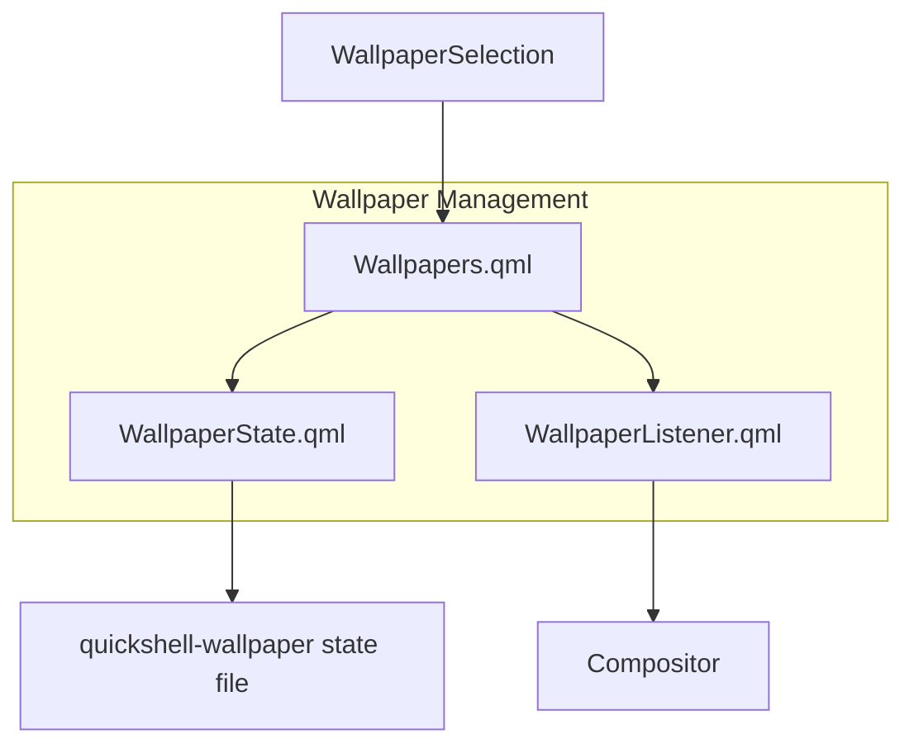
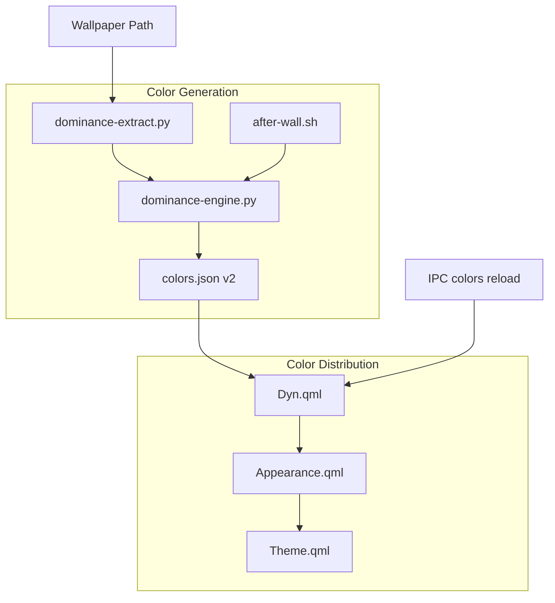
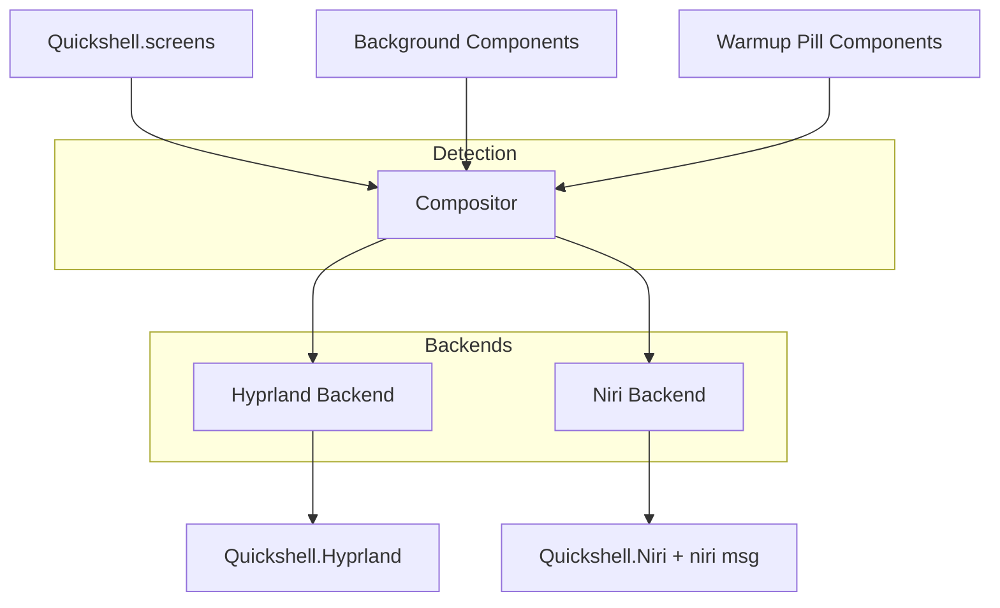
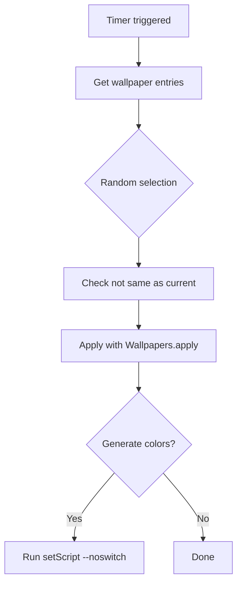
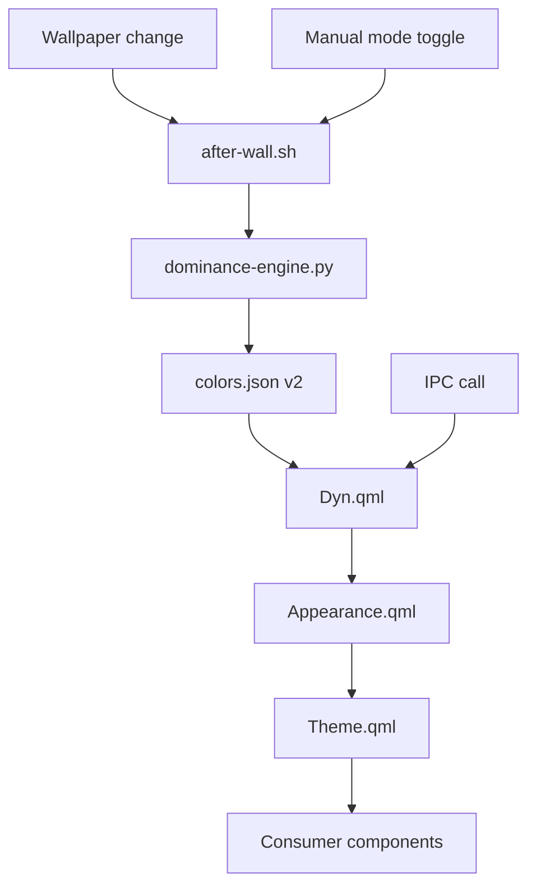

# Wallpaper and Theming System Diagnostic Report

**Date:** 2026-08-28  
**Project:** Yemi QuickShell  
**Status:** Comprehensive Analysis Complete  

---

## Executive Summary

This diagnostic report provides a complete mapping of the wallpaper and theming system in the Yemi QuickShell desktop shell. The system consists of three major pipelines:

1. **Wallpaper Pipeline** - Manages wallpaper selection, display, and per-monitor configuration
2. **Theming Pipeline** - Generates color schemes from wallpapers using the dominance engine
3. **Compositor Abstraction** - Provides unified interface for Hyprland and Niri compositors

---

## 1. Wallpaper Pipeline Architecture

### 1.1 Core Components



#### `modules/background/Wallpaper.qml`
- **Location:** `modules/background/Wallpaper.qml`
- **Type:** PanelWindow component (layered background)
- **Purpose:** Displays the current wallpaper for each screen
- **Key Features:**
  - Supports static images, GIFs, and videos
  - Blur and dim effects via `MultiEffect`
  - WlrLayershell layer: `Background`
  - Excludes from shell windows (`ExclusionMode.Ignore`)

#### `services/Wallpapers.qml`
- **Location:** `services/Wallpapers.qml`
- **Type:** Singleton service
- **Properties:**
  - `wpDir`: Wallpaper directory path
  - `setScript`: Path to wallpaper setter script
  - `globalWallpaperPath`: Current wallpaper from config
  - `autoWallpaperEnabled`: Auto-cycling toggle
  - `autoWallpaperInterval`: Rotation interval (minutes)
  - `autoWallpaperGenerateColors`: Color regeneration on rotate

**Methods:**
- `apply(path, darkMode, monitorName)` - Apply wallpaper to target
- `select(filePath, darkMode, monitorName, target)` - Select with target support
- `currentWallpaperPathForTarget(target, monitorName)` - Resolve target path
- `isCurrentWallpaperPath(path, target, monitorName)` - Check current status
- `_cycleAutoWallpaper()` - Internal auto-rotation logic

#### `services/WallpaperListener.qml`
- **Location:** `services/WallpaperListener.qml`
- **Type:** Singleton service
- **Purpose:** Tracks wallpaper state across multiple monitors
- **Key Properties:**
  - `multiMonitorEnabled`: Multi-monitor wallpaper support
  - `effectivePerMonitor`: Map of per-monitor wallpaper data
  - `isVideoPath(path)`, `isGifPath(path)`, `isAnimatedPath(path)`

**Methods:**
- `refresh()` - Recompute per-monitor wallpaper map
- `getFocusedMonitor()` - Get currently focused monitor
- `getMonitorName(screen)` - Extract monitor name from screen

#### `singletons/WallpaperState.qml`
- **Location:** `singletons/WallpaperState.qml`
- **Type:** Reactive wallpaper reader
- **State File:** `~/.local/state/quickshell-wallpaper` (or `$XDG_STATE_HOME/quickshell-wallpaper`)
- **Properties:**
  - `current`: Current wallpaper path
  - `stateFile`: Path to state file
- **Behavior:** Watches state file for changes via `FileView.watchChanges`

---

## 2. Theming Pipeline Architecture

### 2.1 Overview



### 2.2 Python Scripts

#### `scripts/dominance-extract.py`
- **Purpose:** Extract 8 dominant RGB colors from wallpaper
- **Key Functions:**
  - `extract_dominance(wallpaper)` - Main extraction function
  - Uses ImageMagick for image processing
  - Returns list of 8 RGB tuples (0-1 range)
  - Applies grayscale normalization and deduplication

#### `scripts/dominance-engine.py`
- **Purpose:** Derive full Material 3 color scheme from dominant colors
- **Schema Keys (24 tokens):**
  - `primary`, `on_primary`, `primary_container`, `on_primary_container`
  - `secondary`, `secondary_container`
  - `tertiary`, `tertiary_container`
  - `surface`, `surface_container_lowest`, `surface_container_low`
  - `surface_container`, `surface_container_high`, `surface_container_highest`
  - `on_surface`, `on_surface_variant`
  - `outline`, `outline_variant`
  - `inverse_surface`, `inverse_on_surface`
  - `error`, `on_error`, `error_container`, `on_error_container`

**Key Features:**
- Hue-preserving contrast using WCAG algorithms
- Separate dark and light derivation from same dominants
- Verification checks (A-G) for quality assurance
- Error fallback to fixed palettes when needed

#### `scripts/after-wall.sh`
- **Purpose:** Single writer of colors.json
- **Invocation:** `after-wall.sh <mood> [wallpaper-path]`
- **Pipeline:**
  1. Resolve wallpaper path (from argument or state file)
  2. Check for backdrop theming option
  3. Run `dominance-engine.py`
  4. Write `colors.json` atomically (tmp → target)
  5. Generate `terminal.json` for terminal emulators
  6. Generate `hypr-colors.lua` for Hyprland
  7. Apply terminal colors via `apply-terminal-colors.py`
  8. Signal quickshell via IPC: `qs ipc call colors reload`

**Backdrop Support (D1#6):**
- When `backdropThemeColors=true` and separate backdrop configured
- Derives colors from backdrop image instead of main wallpaper

### 2.3 QML Components

#### `singletons/Dyn.qml`
- **Purpose:** Live wallpaper-derived palette reader
- **State File:** `~/.cache/yemi-shell/colors.json`
- **Schema:** v2 format with nested dark/light objects
- **Properties:**
  - `darkScheme`, `lightScheme`: Full M3 color objects
  - `active`: Currently active scheme (follows `Flags.systemMood`)
  - `schemeValid`: Whether real colors.json loaded
  - `revision`: Bumped on reload for binding refresh

**Flat Token Aliases (both dark/light):**
- `surface`, `surfaceContainer`, `surfaceContainerLow`, `surfaceContainerHigh`, `surfaceContainerHighest`
- `primary`, `primaryContainer`, `onPrimaryContainer`
- `outline`, `outlineVariant`
- `cream` (on_surface), `bright` (on_surface), `subtle` (on_surface_variant)
- `dim` (outline), `faint` (outline_variant), `iconDim` (on_surface_variant)
- `tickRest` (outline)
- Plus 12 new M3 tokens

#### `config/Appearance.qml`
- **Purpose:** Adapts M3 palette to Yemi compatibility tokens
- **Imports:** ColorUtils, Dyn, Flags, DarkMood/LightMood
- **Key Properties:**
  - `isDynamic`: `Flags.paletteMode !== "static"`
  - `isGrayscaleStatic`: `!isDynamic && staticGrayscaleAccents`
  - `auroraEnabled`: `Flags.themeStyle === "aurora"`

**Token Resolution:**
- `yemiTileBgBase`: Dynamic surface or DarkMood.tileBg
- `yemiCardTopBase`: Dynamic surfaceContainerHigh or DarkMood.cardTop
- `yemiCardBotBase`: Dynamic surfaceContainerLow or DarkMood.cardBot
- `yemiCreamBase`: `ColorUtils.ensureReadable(Dyn.onSurface, yemiTileBgBase)`
- `yemiPrimary`: Dynamic or grayscale override
- `yemiPrimaryContainer`: Dynamic or grayscale override
- `flameInk`, `flameEmber`, `flameBurn`, `flameTip`: String hex tokens

#### `singletons/Theme.qml`
- **Purpose:** Pill palette facade (backward compatibility)
- **Surface Tokens:** `tileBg`, `cardTop`, `cardBot`, `ghost`
- **Text Tokens:** `cream`, `bright`, `subtle`, `dim`, `faint`, `iconDim`
- **Accent Tokens:** `onGlow`, `verm`, `vermLit`, `vermDeep`, `vermDim`, `vermDimDeep`, `vermBurn`, `tickRest`
- **Border Token:** `border`
- **Aurora:** `aurora` object with transparentize factors
- **Flame Strings:** `flameInk`, `flameEmber`, `flameBurn`, `flameTip` (type: string)
- **Derived Alpha Tokens:** `hair`, `hairSoft`, `sheen`, `threadBg`, `frameBg`, `frameBorder`, `creamMenu`

#### `config/theme/moods/DarkMood.qml` & `LightMood.qml`
- **Purpose:** Static fallback surfaces when scheme invalid
- **Dark Mode Surfaces:** #000000 base, #141414 cardTop, #0d0d0d cardBot
- **Dark Mode Text:** near-white (#f0f0f0, #ffffff)
- **Light Mode Surfaces:** #ffffff base, #f5f5f5 cardBot
- **Light Mode Text:** near-black (#141414, #000000)

---

## 3. Compositor Abstraction Layer

### 3.1 Architecture



#### `compositor/Compositor.qml`
- **Purpose:** Dispatcher between Hyprland and Niri
- **Detection:** `detectCompositor()` via `XDG_CURRENT_DESKTOP` / `DESKTOP_SESSION`
- **Properties:**
  - `runningCompositor`: "hyprland" or "niri"
  - `impl`: Active backend reference
  - `toplevels`, `workspaces`, `monitors`: Normalized arrays
  - `activeToplevel`, `focusedWorkspace`, `focusedMonitor`
  - `activeWsId`: Currently active workspace ID

**Methods:**
- `dispatch(request)` - Send compositor command
- `monitorFor(screen)` - Map Quickshell screen to monitor
- `getOccupiedWorkspaces()` - Return map of workspaces with windows

#### `compositor/Hyprland.qml`
- **Imports:** `Quickshell.Hyprland`, `QtQuick`
- **Enabled When:** `runningCompositor === "hyprland"`
- **Features:** 500ms refresh timer, raw event forwarding, event-based refresh triggers

#### `compositor/Niri.qml`
- **Imports:** `Quickshell.Io`, `QtQuick`
- **Enabled When:** `runningCompositor === "niri"`
- **Polling:** 500ms timer (Niri has no real-time events)
- **CLI Commands:** `niri msg --json workspaces`, `windows`, `outputs`
- **Transforms Niri outputs** to Hyprland-compatible format

---

## 4. Configuration Flags (Flags.qml)

### 4.1 Wallpaper-Related Flags

| Flag | Type | Default | Purpose |
|------|------|---------|---------|
| `wallpaperUseMainWallpaper` | bool | true | Use main wallpaper vs backdrop |
| `wallpaperHideWhenFullscreen` | bool | false | Hide wallpaper during fullscreen |
| `wallpaperMultiMonitorEnable` | bool | false | Per-monitor wallpaper support |
| `wallpaperSelectionTarget` | string | "" | Target for wallpaper selection |
| `autoWallpaperEnable` | bool | false | Auto-cycle wallpapers |
| `autoWallpaperInterval` | int | 30 | Rotation interval (minutes) |
| `autoWallpaperGenerateColors` | bool | true | Regenerate colors on rotate |
| `autoWallpaperFolder` | string | "" | Source folder for auto-rotation |
| `wallpapersDirectory` | string | "" | Wallpaper directory path |
| `wallpaperEnableAnimation` | bool | false | Enable GIF/video animation |
| `wallpaperEnableBlur` | bool | false | Enable wallpaper blur |
| `wallpaperEnableAnimatedBlur` | bool | false | Blur animated wallpapers |
| `wallpaperBlurRadius` | int | 32 | Blur strength (0-100 scale) |
| `wallpaperAnimatedBlurStrength` | int | 70 | Blur strength for animated |
| `wallpaperDim` | real | 0 | Static dim amount (0-1) |
| `wallpaperDynamicDim` | real | 0 | Dynamic dim based on wallpaper |

### 4.2 Backdrop-Related Flags

| Flag | Type | Default | Purpose |
|------|------|---------|---------|
| `backdropEnable` | bool | true | Show backdrop layer |
| `backdropEffects` | bool | true | Enable blur/saturation |
| `backdropDim` | real | 0.20 | Dim amount |
| `backdropSaturation` | real | 0 | Saturation adjustment |
| `backdropContrast` | real | 0 | Contrast adjustment |
| `backdropEnableAnimation` | bool | false | Animate backdrop |
| `backdropEnableAnimatedBlur` | bool | false | Blur animated backdrops |
| `backdropUseMainWallpaper` | bool | true | Use main wallpaper for backdrop |
| `backdropWallpaperPath` | string | "" | Separate backdrop image |
| `backdropThemeColors` | bool | false | Theme from backdrop image |
| `backdropHideWallpaper` | bool | false | Hide wallpaper behind backdrop |

### 4.3 Color Mode Flags

| Flag | Type | Default | Purpose |
|------|------|---------|---------|
| `paletteMode` | string | "dynamic" | "dynamic", "static" |
| `systemMood` | string | "dark" | "dark" or "light" |
| `staticGrayscaleAccents` | bool | false | Gray accents in static mode |
| `manualHue` | int | 30 | Manual accent hue offset |
| `manualDark` | bool | true | Manual dark mode override |
| `manualSat` | real | 0.5 | Manual saturation control |
| `themeStyle` | string | "yemi" | "yemi" or "aurora" |

---

## 5. Auto-Wallpaper Cycling Mechanism

**Location:** `services/Wallpapers.qml::_cycleAutoWallpaper()`

**Flow:**


**Implementation Details:**
- Timer runs at `autoWallpaperInterval * 60 * 1000` ms
- Random selection with anti-stacking (5 attempts limit)
- Calls `QsSingletons.Walls.setScript` for color regeneration
- State file updated via setter script

---

## 6. Backdrop and Parallax Effects

### 6.1 `modules/background/Backdrop.qml`

**Key Properties:**
- `parallaxOn`: Toggle parallax effect
- `parallaxScale`: Zoom factor (default 1.08)
- `parallaxStrength`: Movement sensitivity
- `parallaxStep`: Calculated movement per workspace
- `wsId`: Current workspace ID
- `dim`: Background dim amount
- `vignette`: Vignette effect strength

**Visual Effects Chain:**
1. Image/AnimatedImage layer
2. MultiEffect: blur, saturation, contrast
3. Dim overlay rectangle
4. Optional vignette gradient masks

### 6.2 Parallax Implementation

```javascript
readonly property real shift: root.parallaxOn 
    ? Math.min(
        Math.max((root.wsId - 1) * root.parallaxStep, 0),
        root.maxShift
    ) : 0
```

---

## 7. IPC Handlers and Color Reload Chain

### 7.1 IPC Handler Flow

```mermaid
graph TD
    A[qs ipc call colors reload] --> B[Dyn.reload()]
    B --> C[FileView.reload()]
    C --> D[onFileChanged/onLoaded]
    D --> E[applyLoaded()]
    E --> F[Parse JSON v2]
    F --> G[_revision++]
    G --> H[Bind updates refresh]
```

**shell.qml IPC Handler:**
```qml
IpcHandler {
    target: "colors"
    function reload(): void {
        QsSingletons.Dyn.reload()
    }
}
```

### 7.2 Color Application Pipeline



**Alternative Path (Direct IPC):**
- `qs ipc call wallpaper <path>` → Wallpaper selection
- `qs ipc call colors reload` → Direct color reload
- `qs ipc call pill <surface> <monitor>` → Open pill surface

---

## 8. Integration Points

### 8.1 Wallpaper-to-Color Flow

1. User selects wallpaper via Pill/Wallpaper UI
2. `Services.Wallpapers.apply(path)` called
3. Background updated via `WallpaperState.current`
4. `after-wall.sh` invoked with wallpaper path
5. `dominance-engine.py` generates `colors.json`
6. `terminal.json` and `hypr-colors.lua` generated
7. IPC `colors reload` signals Dyn.qml
8. Dyn parses and emits new scheme
9. Appearance adapts to new tokens
10. Theme facade provides tokens to consumers

### 8.2 Multi-Monitor Support

- Each screen has its own `Wallpaper.qml` instance
- `WallpaperListener` maintains per-monitor map
- `Compositor.monitorFor(screen)` links Quickshell screens
- Configurable via `wallpapersByMonitor` in config

---

## 9. Diagnostic Findings Summary

### 9.1 Strengths
- Clean separation between wallpaper display and color generation
- Bidirectional compositor abstraction (Hyprland/Niri)
- Robust fallback to static palettes
- Atomic file writes for hotplug safety
- IPC-driven reactive updates

### 9.2 Areas to Review
- Legacy `wallcolors.py` path preserved but unused
- Niri polling latency (500ms) vs Hyprland event-driven
- Flame canvas string requirement vs color properties

### 9.3 Key File Locations

| Component | File | Path |
|-----------|------|------|
| Wallpaper Display | Wallpaper.qml | `modules/background/Wallpaper.qml` |
| Wallpaper State | WallpaperState.qml | `singletons/WallpaperState.qml` |
| Wallpaper Service | Wallpapers.qml | `services/Wallpapers.qml` |
| Wallpaper Listener | WallpaperListener.qml | `services/WallpaperListener.qml` |
| Color Engine | dominance-engine.py | `scripts/dominance-engine.py` |
| Color Extractor | dominance-extract.py | `scripts/dominance-extract.py` |
| After Script | after-wall.sh | `scripts/after-wall.sh` |
| Dynamic Palette | Dyn.qml | `singletons/Dyn.qml` |
| Appearance Adapter | Appearance.qml | `config/Appearance.qml` |
| Theme Facade | Theme.qml | `singletons/Theme.qml` |
| Dark Mood | DarkMood.qml | `config/theme/moods/DarkMood.qml` |
| Light Mood | LightMood.qml | `config/theme/moods/LightMood.qml` |
| Compositor | Compositor.qml | `compositor/Compositor.qml` |
| Hyprland Backend | Hyprland.qml | `compositor/Hyprland.qml` |
| Niri Backend | Niri.qml | `compositor/Niri.qml` |
| Flags | Flags.qml | `singletons/Flags.qml` |

---

## 10. References

- [Theme System Map](docs/color-system/THEME_SYSTEM_MAP_CURRENT.md)
- [Yemi-Shell Theme Rebuild Checklist](docs/color-system/YEMISHELL_THEME_REBUILD_CHECKLIST.md)
- [Compositor Architecture](docs/components/Compositor.md)
- [Matugen Documentation](docs/components/Matugen.md)
- [Wallpaper Component](docs/components/Wallpaper.md)